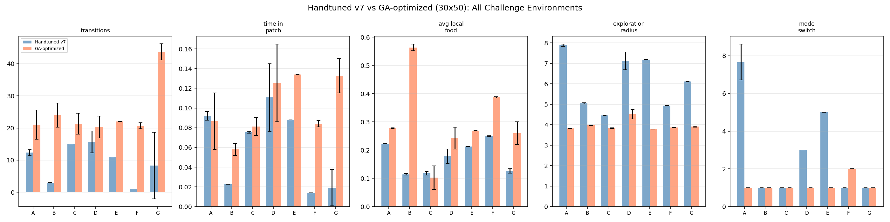
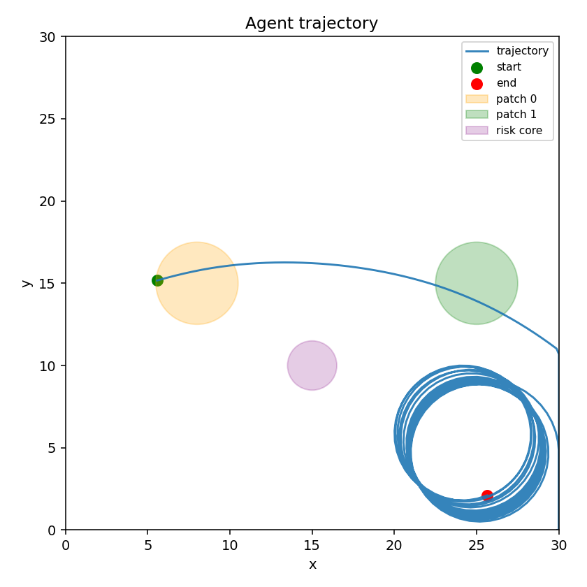
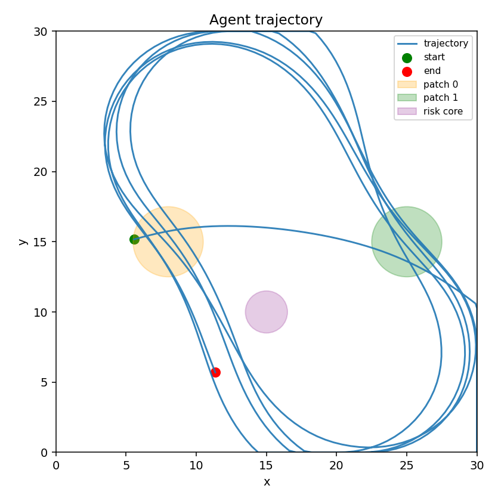
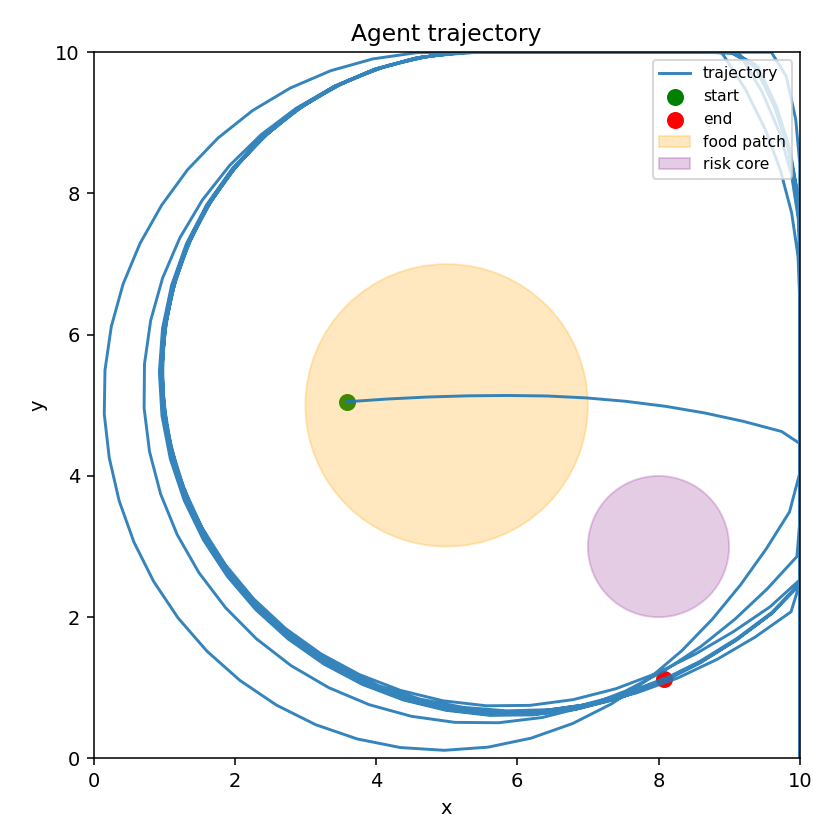
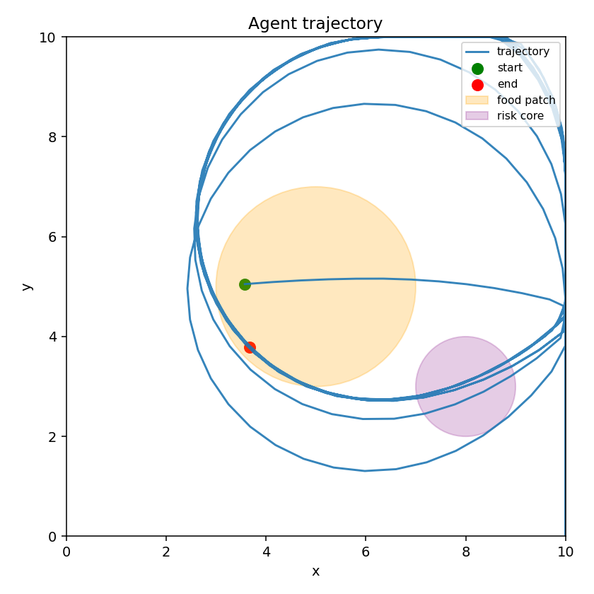
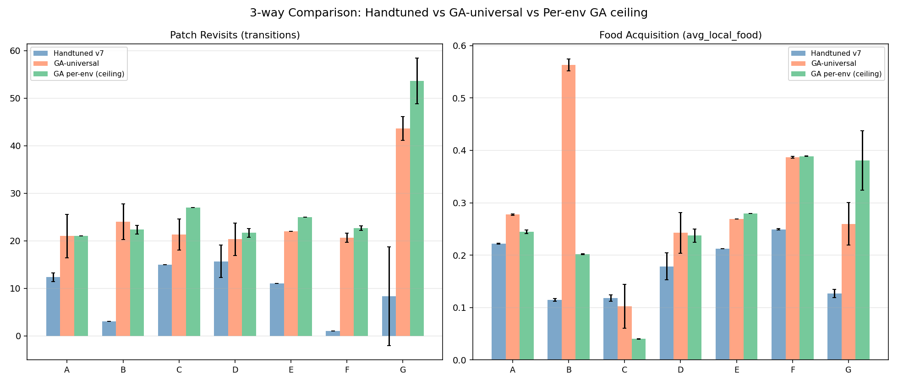

# minimal-enactive-agent

閉じた感覚運動ループの中で、内部状態からどのように振る舞いが立ち上がるのかを調べるための、最小限の身体化エージェントです。

## なぜこのリポジトリがあるのか（動機と立場）

### 出発点の問い

標準的な AI は「固定された目標にどう最適化するか」を問う。このプロジェクトの出発点は違い、
日常的な経験 —— **「今日は何をしようか？」** —— にある。
外部から目標が与えられていないとき、システムは次の行動をどう生成するのか。
これは目標達成ではなく、**目標そのものが立ち上がる瞬間**への問いである。

### なぜ今これが問えるのか — LLM が切り離したもの

LLM は、推論・言語・計画といった認知能力を、身体も感覚運動ループも内発的動機もなしに実現した。
これは **認知能力がエージェンシーの必要条件ではない** ことを示した。
引き算で残るもの —— 世界の中に在ること、内発的に動くこと、行為の結果を引き受けること —— は、
LLM に欠け、スケーリングでは自動的に出てこない。
この「残余」を最小構造から構成論的に組み立てて理解するのが、本リポジトリの目的である。

> 詳細: `docs/research_philosophy.md`, `docs/discussion_summary.md`

### 対象は「知性」ではなく「知性主体」

この「残余」の正体は、**知性（能力）ではなく知性主体（その能力を持って在る存在）** である。
予測・報酬は最適化できる「目的」だが、主体（自律・自己維持・存在）は「目的を持つ存在の前提」であり、
別種の要素である。**LLM は知性を持つが、知性主体ではない。**
プロジェクトが決着をつけうる中心問題は「**主体性は既約か、能力の創発か**」であり、
自己所有の目的は構成的な自己維持としてのみ成立する。これがプロジェクトに核を与え、方向の逸脱を防ぐ。

> 詳細: `docs/intelligent_subject.md`

### 中心命題（＝検証されるべき賭け）

> エージェンシーの本質は認知能力ではなく、世界の中に身体を持って存在し、内発的動機に基づいて
> 行為し、その結果を引き受け続ける構造にある。認知能力はその上に出現する。

これは **前提ではなく仮説** である。逆の立場（認知＝予測が基層で、エージェンシーはそれに
アクチュエータと恒常性を足したもの）も等しく擁護可能であり、それが下記の世界モデル系研究との対立点になる。

### この命題に至った系譜（要約）

「今日は何をしようか」（目標が立ち上がる瞬間への問い）→ 語の乱立（価値・記憶・予測・内部状態…）→
「生物的エージェンシーの最小形」への枠組み転換 → 2 概念（閉ループ＋コヒーレンス駆動）へ圧縮 →
LLM が認知を切り離して見せた残余として中心命題を確定。

ただしこれは厳密な導出ではなく **選ばれた賭け** であり、認知と報酬は「排除」ではなく
「いま入れず、創発するか観察する／必要なら後で内発的価値信号として入れ直す」ための保留である。

> 詳細: `docs/genealogy_central_hypothesis.md`

### この立場が抱える未解決の問い・課題

- **否定的定義の脆さ**: 探求対象が「LLM に欠けるもの」として定義されている。
  競合技術が閉ループや永続記憶を獲得すると、対象が縮みうる。
- **順序の未論証**: 「エージェンシー → 認知」という順序は賭けであり、まだ論証されていない。
- **コヒーレンス駆動が未実装**: 中核概念の「コヒーレンス駆動」は現状エージェント内で計算されておらず、
  良い軌跡への事後的ラベル＋GA 適応度に留まる。
- **増築仮説は未実証**: 実験9（匂い場）で「h 不可欠」が崩れ（h なしが優勢になり）、
  まだ一度も質的に新しい能力を足す「増築」の成功例がない。

> 詳細な批判的検討: `docs/critical_review_meta_neuro_evo.md`

### 類似研究との位置関係

| | 閉ループ | 個体内報酬 | 予測の扱い | 最適化の在処 |
|---|---|---|---|---|
| **本プロジェクト** | 核 | なし | 創発を期待（明示しない） | 世代/設計（GA・手調整） |
| Dreamer 4（世界モデル） | あり | あり | 明示的な世界モデルを学習 | 個体内学習（imagination） |
| 能動推論 / 自由エネルギー原理 | あり | なし（予測誤差最小化） | 明示的な生成モデル | 変分推論 |
| 古典的強化学習 | あり | あり（中心） | 価値/方策に内包 | 報酬最大化 |
| LLM / LLM エージェント | 弱い〜なし | プロンプト/RLHF | 次トークン予測 | 大規模事前学習 |

最も近い対極は **Dreamer 4** である。Dreamer は「正確な世界モデルを建てれば行動は従う」
（予測ファースト）に賭ける。本プロジェクトは「予測モジュールを建てず、閉ループのダイナミクスから
予測的振る舞いが創発する」に賭ける。**この対立は検証可能**であり、本リポジトリの中心的な実験課題でもある
（`docs/critical_review_meta_neuro_evo.md` §3）。

## 概要

このリポジトリは、次の単純な問いを探ります。

> 明示的な外部目標が固定されていないとき、エージェントはどのように次の行動を生成できるのか？

振る舞いを純粋な報酬最大化として扱うのではなく、このプロジェクトは次の 2 つの作業仮説から出発します。

1. **身体-環境の閉ループ**  
   エージェントは感知し、行為し、環境を変え、その変化によって逆に自らも変化する。

2. **状態依存のコヒーレンス駆動**  
   エージェントは、現在の内部状態と継続中の環境との相互作用に、より整合的な行動を生成する傾向をもつ。

## 中核仮説

意味のある原初的エージェントは、次の要素だけから立ち上がるかもしれません。

- **遅い内部状態** h（内臓的・時間的な持続状態）
- **行動モード変数** m（活用/探索/回避のレジーム選択）
- **閉ループ環境**（食物パッチの枯渇と再生、リスク信号）

報酬信号・学習アルゴリズム・外部目標は一切使用しません。

## 最小モデル

$$
\begin{aligned}
h_{t+1} &= (1-\alpha_h) h_t + \alpha_h \tanh(W_{hh} h_t + W_{hm} m_t + W_{hi} i_t + b_h) \\
m_{t+1} &= \text{softmax}\big((1-\alpha_m) u_t + \alpha_m \tanh(W_{uh} h_t + W_{uu} u_t + W_{ui} i_t + b_u)\big) \\
a_t &= W_a m_t + b_a
\end{aligned}
$$

- h: 2 次元（枯渇圧、探索ドリフト）
- m: 3 次元（活用、探索、回避）
- i: 3 次元（局所食物、局所リスク、食物変化量）
- a: 2 次元（旋回、速度）

## 現在の到達点

### 検証された中核仮説

手動設計した重みの符号構造（因果ロジック）を GA で大きさ最適化し、
7 つの多様な環境で同時評価した結果:

- **h は不可欠**: h を除去すると全環境でパッチ再訪が崩壊（13.8回 → 1.0回）
- **時間スケール分離が鍵**: α_h ≪ α_m（h の変化が m より一桁遅い）が必須条件
- **履歴依存性**: 同一の即時観測でも、直前の経験が異なれば行動が変わる（h が記憶を担う）
- **汎用パラメータが存在**: 単一のパラメータ設定で 7 環境の特化上限の 89% を達成

### 手動設計 → GA最適化による改善



| 環境 | 手動設計 | GA最適化 | 改善 |
|---|---|---|---|
| A: 標準環境 | 12.3 回 | 21.0 回 | +70% |
| B: 遠距離パッチ | 3.0 回 | 24.0 回 | +700% |
| C: 高速枯渇 | 15.0 回 | 21.3 回 | +42% |
| D: リスク隣接 | 15.7 回 | 20.3 回 | +29% |
| E: リスクなし | 11.0 回 | 22.0 回 | +100% |
| F: 小さい世界 | 1.0 回 | 20.7 回 | +1970% |
| G: 3パッチ | 8.3 回 | 43.7 回 | +426% |

（再訪回数 = パッチ出入りの遷移数。3シード平均。）

### 特徴的な軌跡の変化

**環境 B（遠距離パッチ）: 手動設計の最大の失敗 → GA で解決**

| 手動設計（1パッチ固着） | GA最適化（広域巡回） |
|---|---|
|  |  |

**環境 F（小さい世界）: パラメータ不適合 → 適応的周回**

| 手動設計（再訪なし） | GA最適化（繰り返し通過） |
|---|---|
|  |  |

### 汎用 vs 環境特化パラメータ



GA-universal（全環境同時最適化）は、環境別に特化した場合の天井値の **89%** を
単一パラメータで達成。残り 11% は環境特化の余地であり、アーキテクチャ制約ではない。

### アーキテクチャの能力と限界

| 能力 | 状態 |
|---|---|
| 単一パッチでの活用-探索切替 | **達成** |
| リスク隣接での適応的回避 | **達成** |
| 遠距離パッチ発見（GA最適化後） | **達成** |
| 小世界での適応（GA最適化後） | **達成** |
| 複数パッチの安定巡回 | **達成**（汎用パラメータで天井の81%） |
| 高速枯渇への適応 | **限界**（枯渇率の推定機構なし） |
| 能動的空間ナビゲーション | **未実装**（空間記憶なし） |

## リポジトリ構成

```
src/
  env.py              - 2D 閉ループ採餌環境（複数パッチ対応）
  agent.py            - h と m をもつ最小リカレントエージェント
  run_simulation.py   - 単一エピソードのシミュレーション
  run_multi_seed.py   - 複数シード × 条件の体系的比較
  run_challenge.py    - 7環境チャレンジスイートのベンチマーク
  run_ga.py           - 遺伝的アルゴリズムによるパラメータ最適化
  eval.py             - 定性的指標の計算
  viz.py              - 軌跡と内部状態の可視化

configs/
  full.yaml           - 完全モデル（v7 ベースライン）
  ablation_no_h.yaml  - アブレーション: h なし
  ablation_no_m.yaml  - アブレーション: m なし
  challenge/          - 7 つのチャレンジ環境設定

docs/
  discussion_summary.md      - 背景と概念的な流れ
  model_spec.md              - モデル詳細と前提
  poc_plan.md                - 実装寄りの PoC 計画
  experiment_plan.md         - 評価計画
  experiment_log.md          - 全実験の詳細記録（画像付き）
  architecture_principles.md - アーキテクチャ進化方針
```

## セットアップ

Python 3.10 以上。uv を推奨。

```bash
uv sync
```

または:

```bash
pip install numpy matplotlib pyyaml
```

## 実行方法

### 単一シミュレーション

```bash
uv run python -m src.run_simulation --config configs/full.yaml
```

### 4条件 × 5シード比較

```bash
uv run python -m src.run_multi_seed
```

### 7環境チャレンジスイート

```bash
uv run python -m src.run_challenge
```

### GA パラメータ最適化

```bash
uv run python -m src.run_ga --pop-size 30 --generations 50 --compare
```

## 実験の経緯

1. **実験 0**: ランダム重みではh の寄与が見えない
2. **実験 1**: 手動重み設計の反復改善（v1-v7）。b_h の重要性、時間スケール分離の発見
3. **実験 2**: 4条件アブレーション。Full model のみが構造化された行動を示す
4. **実験 3**: 履歴依存性の直接検証。h が即時入力では区別できない状態を区別する
5. **実験 4**: パラメータ感度。α_h/α_m 比 ≈ 0.1 が最適、b_h ≥ 0.3 が必須
6. **実験 5**: 複数パッチ環境。パッチ間遷移が h に依存することを確認
7. **実験 6**: 7環境チャレンジスイート。手動設計の能力包絡線を特定
8. **実験 7**: GA最適化。手動設計の「失敗」の大部分がパラメータ問題であることを発見
9. **実験 8**: 汎用 vs 特化パラメータ。単一パラメータで特化上限の 89% を達成

詳細は `docs/experiment_log.md` を参照。

## 設計哲学

- **報酬なし**: 行動は内部状態ダイナミクスから創発する
- **学習なし**: 重みは固定（手動設計 + GA 最適化）。オンライン学習は将来の拡張
- **観測はエージェントの行為**: sense() はエージェント側のメソッド。環境は生の状態のみを持つ
- **アーキテクチャは body plan**: 変数の役割分担は固定し、拡張は増築として行う（`docs/architecture_principles.md`）
