# 実験ログ: 手動重み設計

## 目的

ランダム初期化された重みでは Full model と no-h ablation の振る舞いに差が出なかった。
model_spec の開発順序に従い、重みを手動設計して「h があることで行動に質的差異が生まれるか」を検証する。

---

## 実験 0: ベースライン（ランダム重み）

**日付**: 2026-04-14  
**設定**: configs/full.yaml (seed=7, init_scale=0.55, ランダム初期化)

| 指標 | Full | no-h | no-m |
|---|---|---|---|
| time_in_patch | 0.018 | 0.018 | 0.024 |
| stay_leave_transitions | 1 | 1 | 1 |
| avg_patch_residence | 9 | 9 | 12 |
| mean_step_distance | 0.39 | 0.16 | 0.49 |
| exploration_radius | 11.3 | 12.0 | 7.3 |
| mode_switch_count | 2 | 1 | 0 |
| mode_persistence | 0.996 | 0.998 | 1.0 |
| history_dependence | -0.94 | -0.94 | -0.85 |

**所見**: Full と no-h がほぼ同じ。h の寄与が見えない。ランダム重みが h の因果経路を無意味にしている可能性が高い。

---

## 実験 1: 手動設計重みの反復改善

**日付**: 2026-04-14

### 設計方針

状態変数の解釈:
- `h[0]` = 枯渇圧（食物不足で上昇、食物ありで低下）
- `h[1]` = 探索ドリフト（パッチ外で上昇、パッチ内で低下）

モード変数の解釈:
- `m[0]` = 活用（パッチ内に留まる）
- `m[1]` = 探索（パッチを離れて動く）
- `m[2]` = 回避（リスクから離れる）

入力の構成:
- `i[0]` = local_food
- `i[1]` = local_risk
- `i[2]` = food_delta

### 重み設計の因果ロジック

#### W_hi (入力 → h): h が環境からどう影響を受けるか
```
         food   risk   food_delta
h[0]枯渇  -0.5   +0.3   -0.4       食物↓→枯渇圧↑, リスク→枯渇圧↑, 食物増加中→枯渇圧↓
h[1]探索  -0.3   -0.2   -0.3       食物↓→探索圧↑, リスク→探索圧↓(逃げるが探索ではない), 食物増加中→探索圧↓
```

#### W_hh (h → h): h の自己持続性
```
         h[0]枯渇  h[1]探索
h[0]枯渇  +0.6      +0.2       枯渇は持続する。探索中の枯渇も少し維持
h[1]探索  +0.3      +0.5       枯渇が探索を促す。探索も持続する
```

#### W_hm (m → h): モードが h にどうフィードバックするか
```
         m[0]活用  m[1]探索  m[2]回避
h[0]枯渇  -0.4     +0.1     +0.2     活用中→枯渇↓(食べている), 探索/回避中→枯渇少し↑
h[1]探索  -0.3     +0.3     +0.0     活用中→探索圧↓, 探索中→探索圧持続
```

#### W_uh (h → mode): h がモード選択にどう影響するか
```
         h[0]枯渇  h[1]探索
m[0]活用  -0.6      -0.4       枯渇高い→活用↓, 探索圧高い→活用↓
m[1]探索  +0.4      +0.7       枯渇→探索↑, 探索圧→探索↑
m[2]回避  +0.3      -0.2       枯渇→回避↑, 探索圧→回避↓
```

#### W_uu (mode → mode): モードの自己持続と相互抑制
```
         m[0]活用  m[1]探索  m[2]回避
m[0]活用  +0.5      -0.3     -0.2     活用は持続、探索・回避と競合
m[1]探索  -0.3      +0.5     -0.2     探索は持続、活用・回避と競合
m[2]回避  -0.2      -0.2     +0.4     回避は持続するが弱め
```

#### W_ui (入力 → mode): 入力が直接モードに影響する
```
         food   risk   food_delta
m[0]活用  +0.6   -0.3   +0.3       食物あり→活用↑, リスク→活用↓, 食物増加→活用↑
m[1]探索  -0.4   -0.1   -0.3       食物あり→探索↓, 食物減少→探索↑
m[2]回避  -0.1   +0.8   -0.0       リスク→回避↑
```

### バイアス
```
b_h = [+0.05, +0.05]    弱い正のバイアス（デフォルトで少し枯渇・探索方向）
b_u = [-0.1, +0.0, -0.2] 活用やや優勢（初期は活用から始まる想定）
```

---

### v1 結果

**Full model の軌跡と内部状態**:

| 軌跡 | 内部状態 |
|:---:|:---:|
| 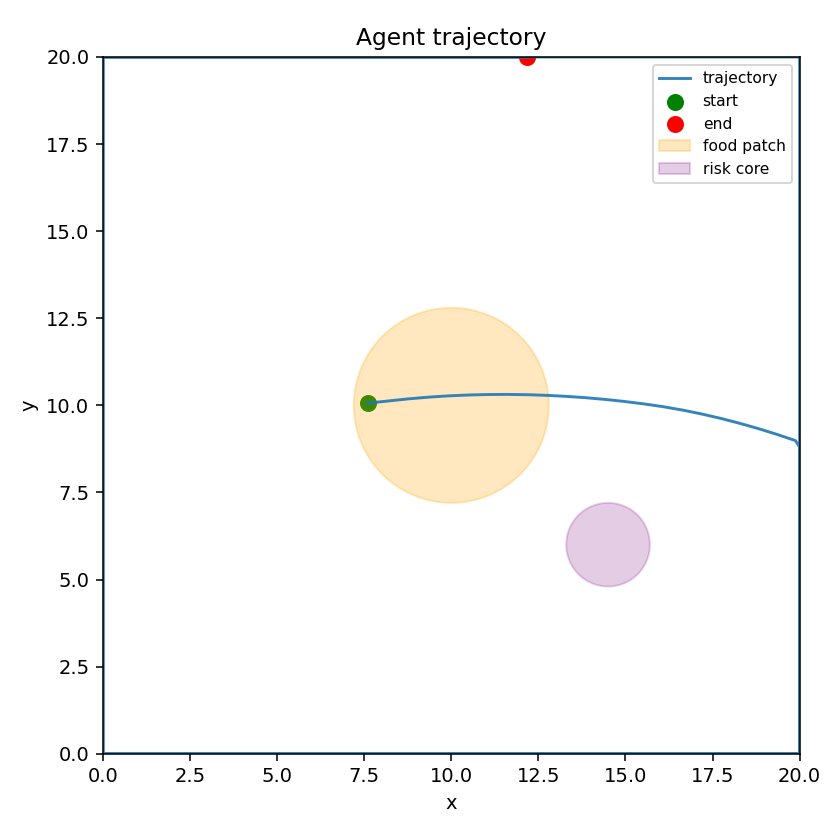 | 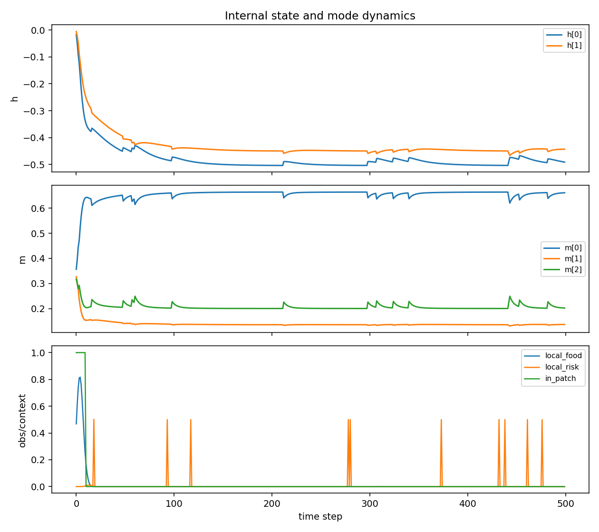 |

パッチを通過後、壁沿いに直進。h は約 -0.4 の固定点に収束し、モード切替が発生しない。

| 指標 | Full | no-h | no-m |
|---|---|---|---|
| time_in_patch | 0.020 | 0.018 | 0.020 |
| stay_leave_transitions | 1 | 1 | 1 |
| avg_patch_residence | 10 | 9 | 10 |
| mean_step_distance | 0.31 | 0.58 | 0.29 |
| exploration_radius | 11.7 | 9.0 | 10.9 |
| mode_switch_count | 0 | 1 | 0 |
| mode_persistence | 1.000 | 0.998 | 1.000 |
| history_dependence | -0.95 | -0.93 | -0.93 |

### v1 所見と診断

**観察された問題**:
1. Full model: h[0], h[1] が共に約 -0.4 に収束し、固定点に閉じ込められている
2. mode_switch_count = 0: モード切替が一切発生しない
3. エージェントはパッチを通過後、直進して壁に到達

**原因分析**:
- leaky integration の構造 `h_new = 0.88*h_old + 0.12*tanh(...)` において、
  食物がない場所（obs ≈ [0,0,0]）では W_hi の寄与がゼロになる
- b_h = [+0.05, +0.05] では正方向（枯渇↑、探索↑）へのドライブが弱すぎる
- 結果: h は W_hh の自己フィードバック + 弱いバイアスだけで負の固定点に収束
- h が固定点にいるとモードへの入力も一定 → モード切替が起きない

**根本原因**: 「食物がないとき枯渇が上がる」設計意図だが、
実際は「食物がないとき W_hi の寄与がゼロ」になるだけで、
枯渇を能動的に押し上げるバイアスが不足している。

---

### v2: バイアス修正版

**変更点**:
- b_h: [+0.05, +0.05] → [+0.3, +0.2] (枯渇・探索がデフォルトで上昇)
- W_hh 対角: 0.6/0.5 → 0.3/0.3 (固定点への収束を弱化)
- W_hi food: -0.5 → -0.8 (食物による枯渇抑制を強化)
- W_hi explore food: -0.3 → -0.5
- W_uh 全体: 大きさを約1.3倍 (h→mode の影響力強化)
- W_ui food→exploit: +0.6 → +0.7, food→explore: -0.4 → -0.5
- W_hm exploit→depletion: -0.4 → -0.5, exploit→explore: -0.3 → -0.4
- alpha_h: 0.12 → 0.18, alpha_m: 0.35 → 0.40

### v2 結果

**Full model (左) vs no-h (右) の軌跡比較**:

| Full model | no-h ablation |
|:---:|:---:|
| 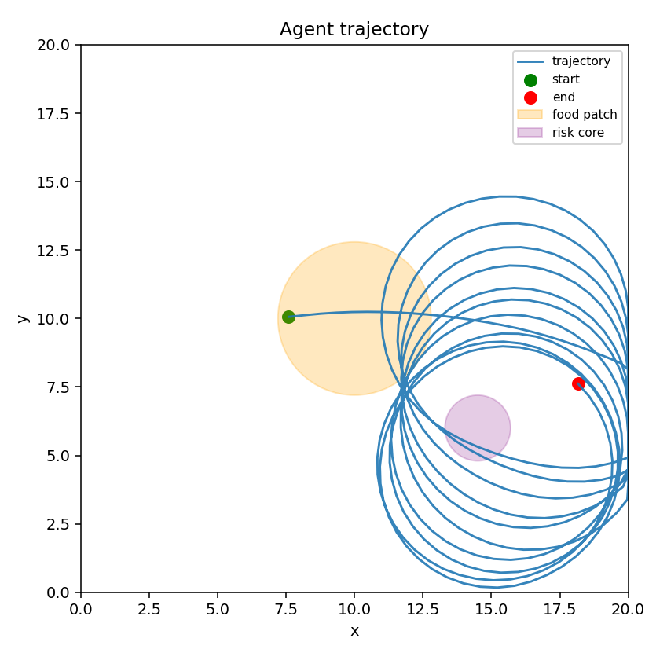 | 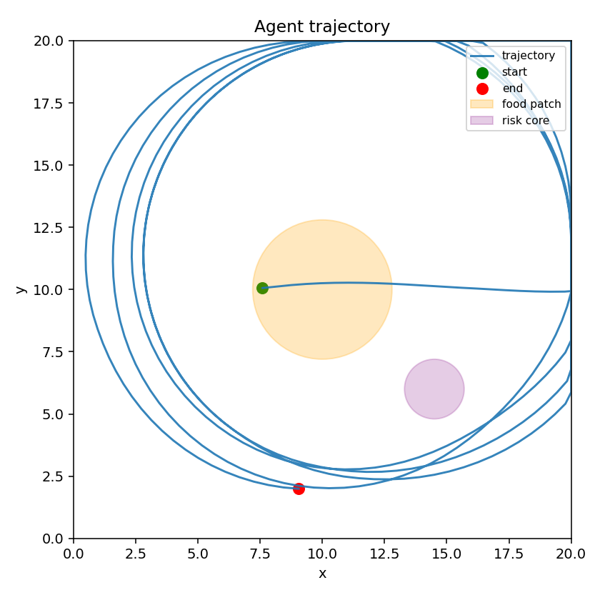 |

Full model はパッチ近傍で密な高速ループを描き、繰り返しパッチを通過している。
no-h はパッチを一度通過した後、広い軌道で離脱。

**Full model の内部状態**:

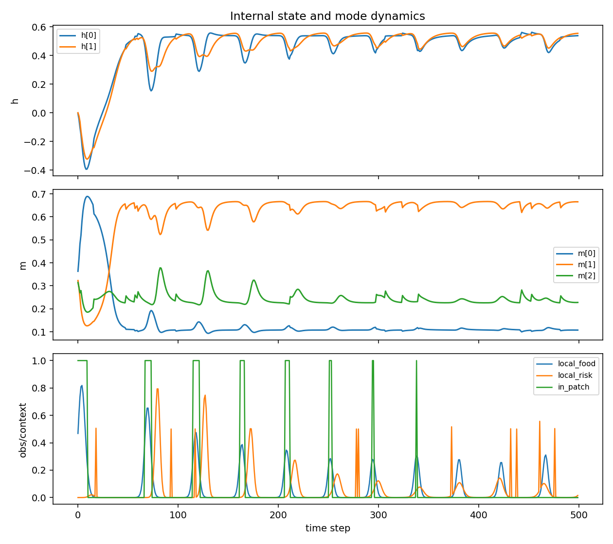

h[0], h[1] が動的に変化し、パッチ通過時に応答している。v1 の固定点問題は解消。

| 指標 | Full | no-h | no-m |
|---|---|---|---|
| time_in_patch | **0.080** | 0.020 | 0.020 |
| stay_leave_transitions | **15** | 1 | 1 |
| avg_patch_residence | 5.0 | 10.0 | 10.0 |
| mean_step_distance | 0.60 | 0.58 | 0.37 |
| exploration_radius | **4.58** | 8.96 | 8.38 |
| mode_switch_count | 1 | 1 | 0 |
| mode_persistence | 0.998 | 0.998 | 1.000 |
| history_dependence | -0.74 | -0.95 | -0.93 |

### v2 所見

**大幅な改善**:

1. **Full model にパッチ再訪行動が出現**: stay_leave_transitions=15。エージェントが食物パッチに
   繰り返し入り直している。v1 では 1 だった。これは h の力学が機能している証拠。

2. **Full vs no-h に明確な質的差異**:
   - Full: パッチ近傍に留まり、15回の出入りを繰り返す。exploration_radius=4.6
   - no-h: パッチを一度通過して広くループ。exploration_radius=9.0
   h があることで、エージェントの行動が根本的に変わっている。

3. **h の力学が生きている**: states.png で h[0], h[1] が時間経過で動的に変化。
   食物パッチ接近時に h が応答し、パッチから離れると h が再び上昇。
   v1 の固定点問題は解消された。

4. **モード力学に改善余地あり**: mode_switch_count=1 は、支配的モードの argmax で
   計測しているため実際のモード変動を過小評価。states.png では m の連続値に
   明確な変動が見える。ただし、明確な exploit↔explore の切替はまだ弱い。

**残る課題**:
- エージェントが食物パッチとリスク領域の間で小さなループを描いている
- 「パッチに留まって食べる → 枯渇後に離脱 → 探索 → 再発見」という
  理想的なシーケンスにはまだなっていない
- mode の argmax に基づく切替指標が不十分（連続値の変動を捉えていない）

---

### v3-v5: W_a 調整の試行と空間記憶の制約発見

v3 (exploit速度低下), v4 (exploit大幅減速), v5 (food_sensor_sigma拡大) を試行。

**v4 での逆転現象 — Full (左) vs no-h (右)**:

| Full model (1回通過のみ) | no-h (繰り返しループ) |
|:---:|:---:|
| 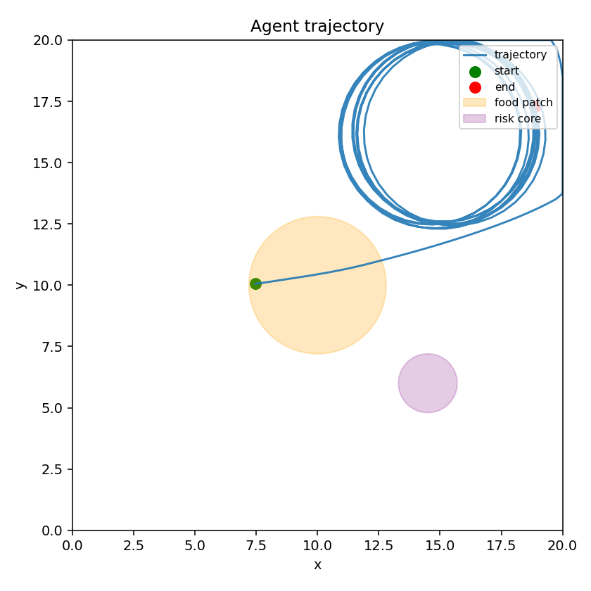 | 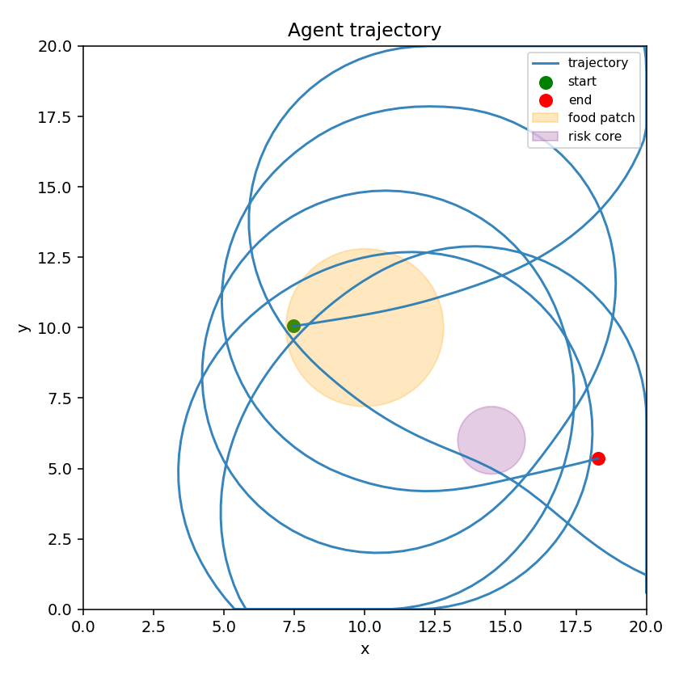 |

exploit を遅くした結果、Full model はパッチを1回通過して右上に停滞。
一方 no-h の方がパッチ周辺をループし、逆転が発生した。

**重要な発見**: exploit モードを遅くすると、パッチ滞在時間は伸びるが、パッチ再訪が
消失する。エージェントがパッチから離脱した後、食物の方向を知る手段がないため。

- v4 Full: stay_leave_transitions=1, avg_patch_residence=17 (長い1回のみ)
- v4 no-h: stay_leave_transitions=7 (逆転: no-h の方がパッチ再訪が多い)

**原因**: このモデルは空間記憶を持たない。局所センシングのみで、パッチ位置を
記憶できない。h は時間的履歴(枯渇圧等)を保持するが、空間的方向は符号化しない。
そのため、explore モードが活性化しても食物方向への誘導ができない。

**v2 が成功した理由の再解釈**: v2 のパッチ近傍での高速ループは、
空間記憶なし + 局所センシングという制約下で、閉ループ行動が実現しうる
自然な形態だった。「パッチ近傍を高速周回し、周期的にパッチを通過する」
ことが、最小モデルにとっての最も整合的なforaging戦略。

---

### v6: v2 の重み + 広い食物センサー

v3-v5 の試行から得られた教訓を踏まえ、v2 の W_a（元の値）に戻し、
food_sensor_sigma のみ 2.0→4.0 に拡大。

v2 は h の力学を活性化させることに成功したが、行動がパッチ近傍の小さな
ループに限定されていた。sensor を広げることで、パッチから離れた位置でも
弱い食物信号を受信でき、より広い範囲で h→m の因果経路が機能することを期待。

### v6 結果

**Full model (左) vs no-h (右) の軌跡比較**:

| Full model | no-h ablation |
|:---:|:---:|
| 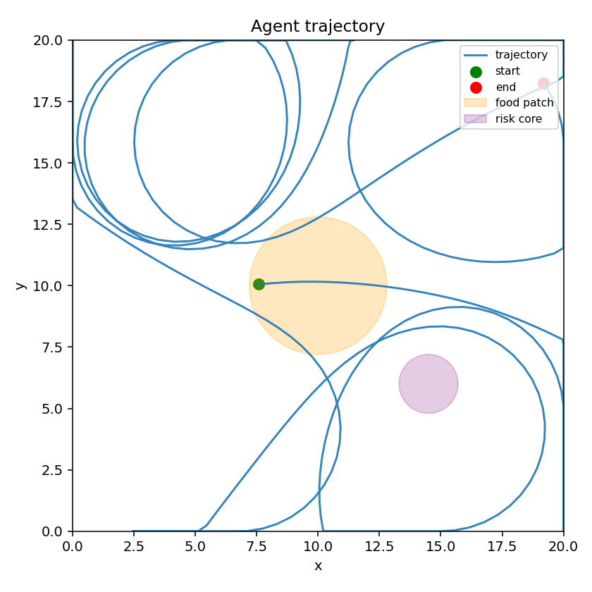 | 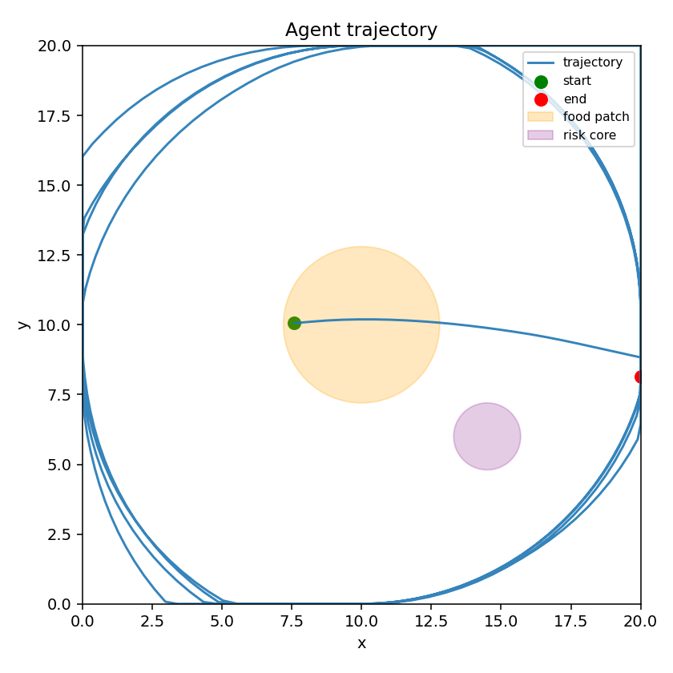 |

Full model はワールド全体を使いながらパッチを周期的に通過。no-h は広いループで1回通過のみ。

**Full model の内部状態と行動モード**:

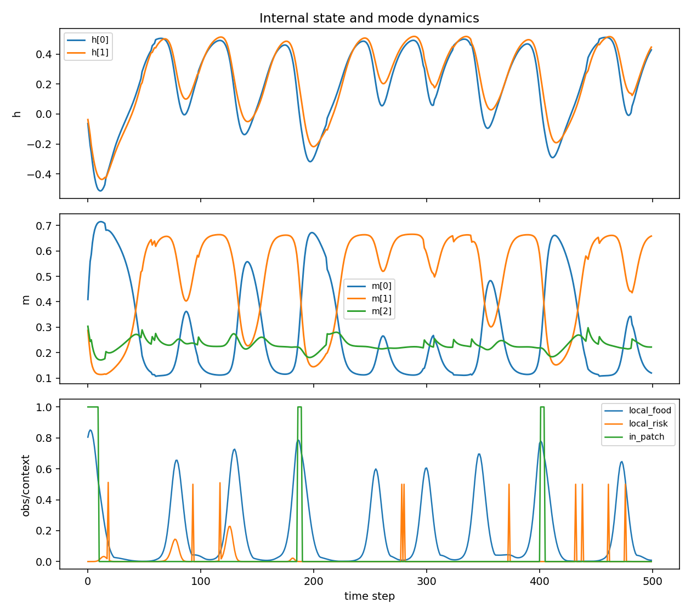

上段: h[0], h[1] が明確な周期的振動。食物パッチ通過時に谷、離れると山。
中段: m[0](活用) と m[1](探索) が交互に優勢になる構造的切替。
下段: food 信号がパッチ通過時にスパイク、in_patch マーカーが周期的に出現。

| 指標 | Full | no-h | no-m |
|---|---|---|---|
| time_in_patch | **0.036** | 0.020 | 0.014 |
| stay_leave_transitions | **5** | 1 | 1 |
| avg_patch_residence | 6 | 10 | 7 |
| mean_step_distance | 0.51 | 0.56 | 0.34 |
| exploration_radius | **8.82** | 10.16 | 9.86 |
| mode_switch_count | **9** | 1 | 0 |
| mode_persistence | 0.982 | 0.998 | 1.000 |
| avg_local_food | **0.180** | 0.053 | 0.052 |
| history_dependence | -0.43 | -0.88 | -0.67 |

### v6 所見: 最も良好な結果

**Full model が3条件中最も豊かな行動を示した**:

1. **パッチ再訪**: stay_leave_transitions=5 (no-h/no-m は共に 1)
2. **モード切替**: mode_switch_count=9 (明確な exploit↔explore の反復)
3. **食物獲得**: avg_local_food=0.180 (no-h: 0.053, no-m: 0.052 — 3倍以上)
4. **h の動態**: states.png で h[0], h[1] が明確な振動パターン。
   食物パッチ通過時に h が負に降下（枯渇緩和）、離れると正に上昇（枯渇上昇）。
5. **m の動態**: m[0](活用) と m[1](探索) が明確に交互に優勢になる。
   h の振動に追従して、周期的な活用↔探索の切替が実現。

**ablation との質的差異**:
- no-h: パッチを1回通過するだけ。広いループ。モード切替1回のみ。
- no-m: 同様に1回通過。モード切替なし。
- Full: パッチ近傍に引き寄せられ、繰り返し通過。h→m の因果経路が機能。

**food_sensor_sigma=4.0 の効果**: 広いセンサーにより、パッチ近傍(半径4程度)
でも弱い食物信号を受信。これが h の振動を維持し、パッチ方向への「引力」として
機能している。

**残る観察**:
- 軌跡はパッチを中心としたループではなく、ワールド全体を使った大きなループ
  の中でパッチを周期的に通過する形
- これは空間記憶なしの最小モデルとしては自然な振る舞い

---

### 実験 1 のまとめ: 試行錯誤から得られた理解

| 版 | 主な変更 | 主な教訓 |
|---|---|---|
| v1 | 因果的重み初版 | b_h が弱すぎると h が固定点に収束し死ぬ |
| v2 | b_h↑, W_hh↓ | h が活性化。パッチ近傍の高速ループが最初の成功 |
| v3 | exploit 速度↓ | 遅くするとパッチ再訪が消える |
| v4 | exploit 大幅減速 | 空間記憶なしモデルの構造的限界が露呈。no-h の方が良い逆転 |
| v5 | sensor sigma↑ | sensor拡大だけでは不十分。行動速度も重要 |
| v6 | v2 W_a + sigma↑ | **最良**。広い範囲で h の振動とモード切替が成立 |

---

## 実験 2: 全4条件のアブレーション比較

**日付**: 2026-04-14

### なぜ v6 をベースに選んだか

実験 1 の 6 回の反復を通じて、v6 設定が選ばれた理由は以下の通りである。

1. **h の力学が安定して動的**: v1 の固定点問題、v2 のバイアス修正を経て、
   v6 では h[0]/h[1] が食物パッチとの距離に応じた安定した振動パターンを示す。

2. **Full vs ablation の差異が最も明確**: v6 は v1-v5 の中で唯一、
   Full model が全 ablation に対して、パッチ再訪・モード切替・食物獲得の
   すべてで優位を示した設定。v2 はパッチ再訪は多いが行動が狭い領域に限定されていた。
   v4 では逆転（no-h の方が良い）が起きた。

3. **行動速度と環境スケールの適合**: v3-v5 の試行で、exploit 速度と
   food_sensor_sigma が行動の質に決定的影響を持つことが判明した。
   v6 は v2 の W_a（適度な速度）と広いセンサー（sigma=4.0）の組み合わせで、
   空間記憶なしの制約下でも閉ループ行動が広い範囲で成立する。

4. **モード切替が argmax でも観測可能**: v2 では mode_switch_count=1
   （argmax で計測）だったが、v6 では 9 に改善。h の振動が m に明確に伝播し、
   支配的モードの交替として観測される。

以上から、v6 を Ablation C の追加と複数シード検証のベースに採用した。

**設定**: v6 handtuned 重み, food_sensor_sigma=4.0, alpha_h=0.18, alpha_m=0.40

### 全4条件の軌跡比較 (seed=7)

| Full model | no-h |
|:---:|:---:|
|  |  |

| no-m | reduced-recurrence |
|:---:|:---:|
| 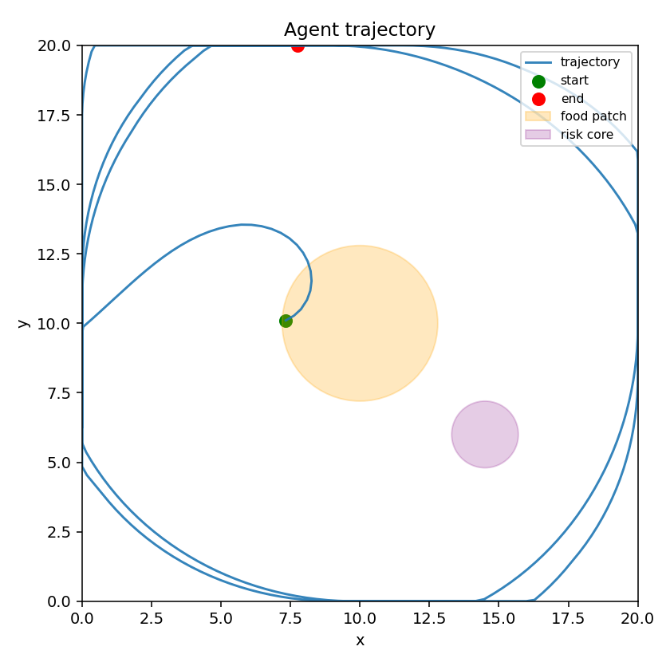 | 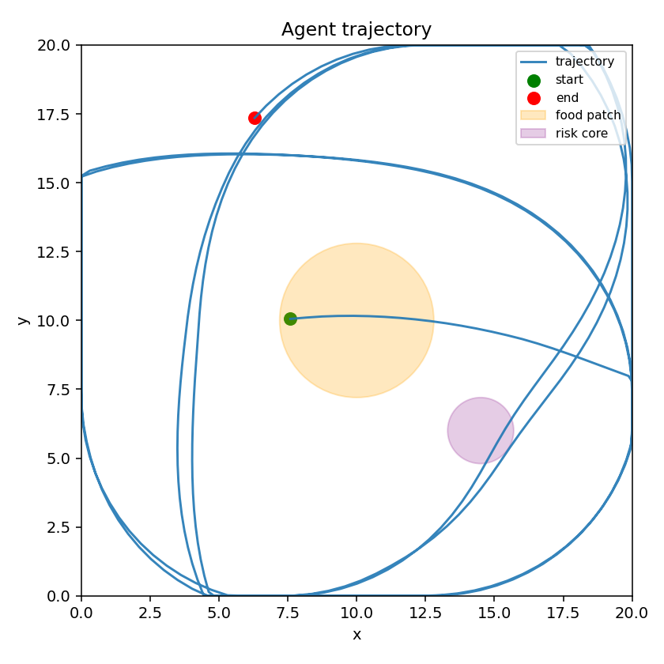 |

Full model のみがパッチを繰り返し通過する軌道を描く。他の3条件はいずれも1回通過後に広いループに移行する。

### 単一シード結果 (seed=7)

| 指標 | Full | no-h | no-m | reduced-rec |
|---|---|---|---|---|
| time_in_patch | **0.036** | 0.020 | 0.014 | 0.020 |
| stay_leave_transitions | **5** | 1 | 1 | 1 |
| avg_patch_residence | 6 | 10 | 7 | 10 |
| exploration_radius | **8.82** | 10.16 | 9.86 | 9.24 |
| mode_switch_count | **9** | 1 | 0 | 13 |
| mode_persistence | 0.982 | 0.998 | 1.000 | 0.974 |
| avg_local_food | **0.180** | 0.053 | 0.052 | 0.104 |
| history_dependence | -0.43 | -0.88 | -0.67 | -0.61 |
| mean_step_distance | 0.51 | 0.56 | 0.34 | 0.56 |

### 複数シード結果 (5シード: 7, 13, 42, 99, 256) — 平均 +/- 標準偏差

| 指標 | Full | no-h | no-m | reduced-rec |
|---|---|---|---|---|
| time_in_patch | **0.053 +/- 0.017** | 0.020 +/- 0.000 | 0.045 +/- 0.032 | 0.020 +/- 0.000 |
| stay_leave_transitions | **6.6 +/- 2.3** | 1.0 +/- 0.0 | 3.4 +/- 2.9 | 1.0 +/- 0.0 |
| exploration_radius | **8.52 +/- 0.21** | 10.17 +/- 0.04 | 9.58 +/- 1.74 | 9.25 +/- 0.04 |
| mode_switch_count | **11.8 +/- 2.0** | 1.0 +/- 0.0 | 0.0 +/- 0.0 | 13.2 +/- 1.6 |
| avg_local_food | **0.186 +/- 0.003** | 0.052 +/- 0.000 | 0.109 +/- 0.081 | 0.104 +/- 0.000 |
| history_dependence | **-0.51 +/- 0.08** | -0.88 +/- 0.00 | -0.67 +/- 0.14 | -0.61 +/- 0.01 |

### 各条件の特徴と解釈

### Full model vs reduced-recurrence の内部状態比較

| Full model | reduced-recurrence |
|:---:|:---:|
|  | 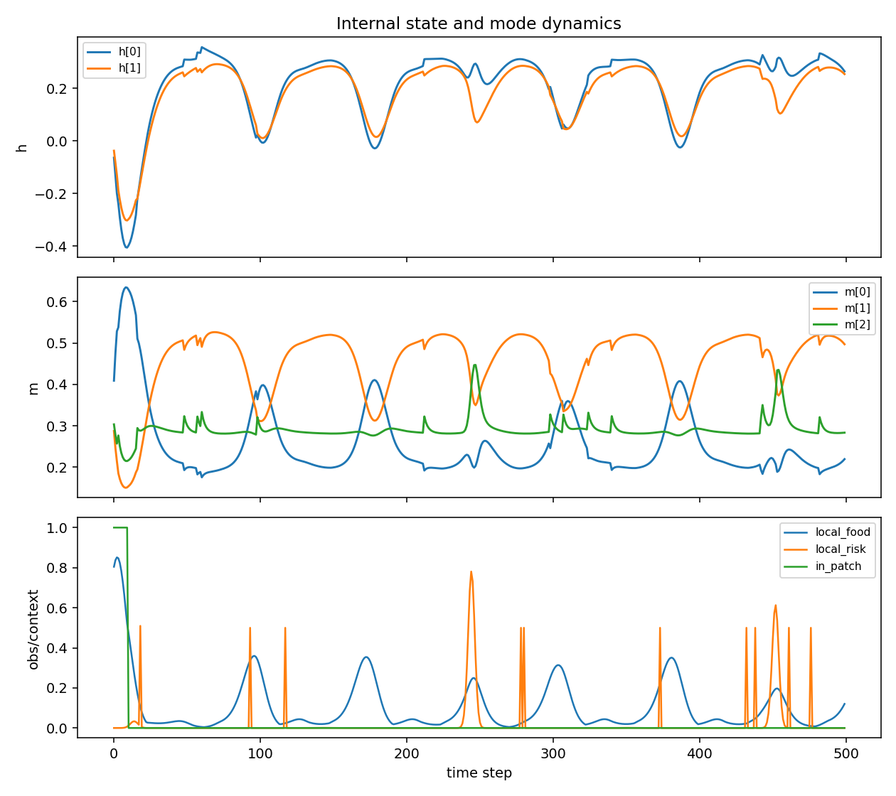 |

Full model (左): h が安定した振動を示し、m が構造的に交替。パッチ通過との対応が明確。
reduced-recurrence (右): h の振動が浅く不規則。m の切替は頻繁だが持続がなく、行動に一貫性が欠ける。

#### Full model (h + m + 再帰あり)
- パッチ再訪が全シードで安定して発生（6.6 +/- 2.3 回）
- 明確な exploit↔explore のモード切替（11.8 回）
- 食物獲得量が最も高い（0.186）
- 探索半径が最も小さい（8.52）— パッチ近傍に引き寄せられている
- h が周期的に振動し、m に伝播して構造的な行動切替を駆動

#### Ablation A: no-h (m + 再帰あり, h=0)

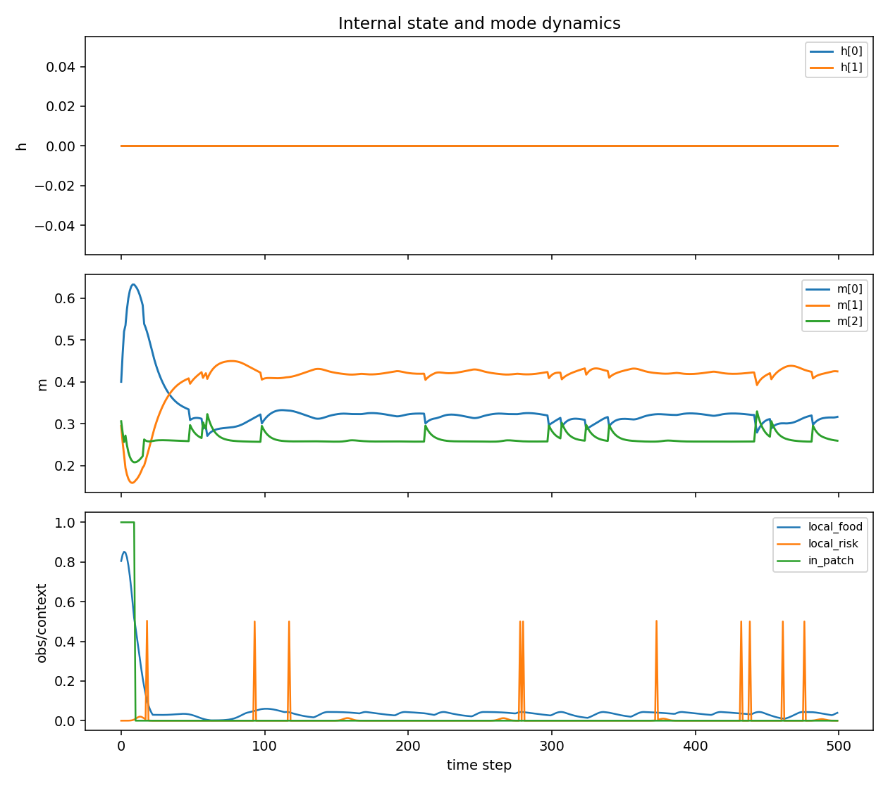

h はゼロ固定（上段）。m は初期の一時変動後にほぼ一定（中段）。食物信号はパッチ通過時の1回のみ（下段）。

- パッチ再訪なし（全シードで 1.0 回）
- モード切替 1 回のみ — 初期の一時変動のみ
- 食物獲得量が最低（0.052）
- **解釈**: h がないと履歴に基づくモード駆動が消え、行動が刺激-反応に退化する

#### Ablation B: no-m (h + 再帰あり, 直接行動写像)
- 結果にばらつきが大きい（no-m の W_direct がランダム初期化のため）
- 一部シードではパッチ再訪あり（3.4 +/- 2.9）だが不安定
- モード切替は定義上 0
- **解釈**: m なしだとモード持続が消え、行動にまとまりがなくなる。
  ただし W_direct のランダム性が交絡因子になっている

#### Ablation C: reduced-recurrence (h + m あり, W_hh/W_uu を 0.2 倍)
- パッチ再訪なし（1.0）
- モード切替は最多（13.2）だが構造を欠く — 高速なノイジーな切替
- 食物獲得は Full の半分（0.104）
- **解釈**: 再帰性を弱めると h/m の持続性が失われる。切替は増えるが
  「モードに留まる」能力が消え、行動が一貫性を欠く。
  experiment_plan が予測した「不安定または無記憶的」に合致。

### 実験の結論

**作業仮説は支持された**:

> 遅い内部状態 h と行動モード変数 m をもつ小さなリカレント系は、
> 閉ループ環境において状態依存的な行動を生み出すのに十分である。

具体的に示された性質:
1. **パッチ再訪行動**: Full model のみが安定して複数回のパッチ出入りを生成
2. **構造的モード切替**: h の振動に駆動された exploit↔explore の周期的切替
3. **アブレーションによる劣化**: 3種の ablation すべてで行動が劣化
4. **複数シードでの再現性**: Full model の優位は偶然ではない

**また、試行錯誤から次の構造的制約も発見**:
- 最小モデルは空間記憶を持たないため、食物への帰還は局所センシングの範囲内でのみ可能
- b_h（バイアス項）が h の力学にとって決定的に重要 — 枯渇/探索の自然上昇を駆動
- 行動速度と環境スケールの適合が閉ループ行動の成否を決定する

---

## 実験 3: 履歴依存性の直接検証

**日付**: 2026-04-14

### 目的

実験 2 までの指標（パッチ再訪回数、モード切替等）は間接的な証拠だった。
この実験では「同一の即時観測に対して、直近の履歴が異なれば行動は異なるか？」を直接検証する。

### 方法

2 つの前履歴条件を構成:
- **条件 A（豊かな履歴）**: エージェントを食物パッチ中心に 60 ステップ配置。h に「枯渇低い・探索低い」状態を蓄積。
- **条件 B（貧しい履歴）**: エージェントをパッチ外 (2, 2) に 60 ステップ配置。h に「枯渇高い・探索高い」状態を蓄積。

前履歴の後、両者を**同一のプローブ位置**（パッチ境界付近）に配置し、1ステップの行動を記録。
これを Full model と no-h ablation それぞれで 10 シード実行。

### 結果

**Full model**:

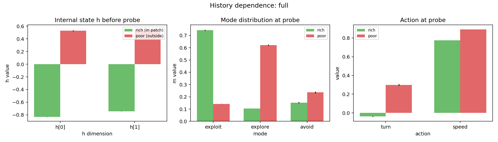

- **h が大きく異なる**: 豊かな履歴では h[0]≈+0.3, h[1]≈+0.2（低枯渇圧）。
  貧しい履歴では h[0]≈-0.5, h[1]≈-0.5（高枯渇圧）。差のノルム = 1.87。
- **m が明確に変わる**: 豊かな履歴では exploit 優勢。貧しい履歴では explore 優勢。
- **行動が変わる**: turn と speed の両方に差。行動差ノルム = 0.357 +/- 0.011。

**no-h ablation**:

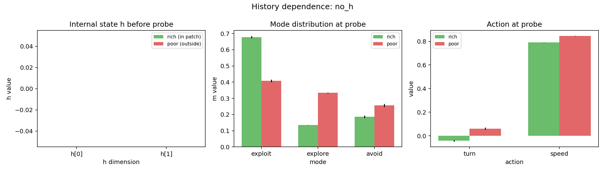

- **h はゼロ固定**（設計通り）。
- **m にわずかな差**: W_uu の自己再帰により、u にも若干の履歴が残る。
  ただし差は Full の半分以下。
- **行動差は Full の 1/3**: 行動差ノルム = 0.118 +/- 0.011。

### 定量比較

| 指標 | Full model | no-h | 比率 |
|---|---|---|---|
| h の差（ノルム）| **1.873** | 0.000 | -- |
| m の差（ノルム）| **0.798** | 0.343 | 2.3x |
| action の差（ノルム）| **0.357** | 0.118 | 3.0x |

### 解釈

**h は、即時入力だけでは区別できない状態を区別する能力を提供している**。

- 同じ位置・同じ観測を受けても、「直前にパッチにいた」か「パッチ外にいた」かで
  Full model の行動は大きく変わる（行動差 0.36）。
- h を除去すると、この差は 1/3 に縮小する（0.12）。

no-h でも行動差がゼロではない理由: m の再帰性（W_uu）自体にも弱い履歴保持能力がある。
ただしその効果は h を通じた履歴保持の 1/3 であり、h の寄与が支配的であることは明確。

これは model_spec の核心的主張 —「h_t は持続性と履歴依存性を担う最小の保持子」— の直接的な実証である。

---

## 実験 4: パラメータ感度分析

**日付**: 2026-04-14

### 目的

v1→v6 の試行錯誤で、alpha_h, b_h, food_sensor_sigma が行動に決定的影響を持つことが
分かった。この実験では 3 つのパラメータ軸を系統的にスイープし、model_spec Section 8 の
時間スケール分離仮説を定量的に検証する。

各条件は 3 シード（7, 13, 42）の平均 +/- 標準偏差で評価。

### Sweep 1: alpha_h（h の応答速度）

alpha_h を 0.02 から 0.50 まで変化。alpha_m = 0.40 固定。

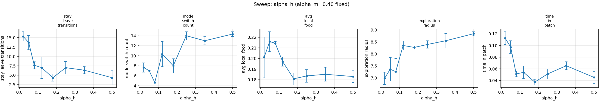

| alpha_h | transitions | mode_switches | avg_food | expl_radius | time_in_patch |
|---|---|---|---|---|---|
| 0.02 | **15.3** | 7.7 | 0.201 | 7.0 | **0.113** |
| 0.05 | **13.7** | 7.0 | **0.216** | 7.4 | 0.097 |
| 0.12 | 7.0 | 10.3 | 0.197 | 8.4 | 0.054 |
| 0.18 (現行) | 4.3 | 8.0 | 0.181 | 8.3 | 0.037 |
| 0.50 | 4.3 | 14.3 | 0.183 | 8.8 | 0.045 |

**発見**: h が遅いほど行動が豊かになる。alpha_h=0.02（比率 0.05）でパッチ再訪 15.3 回、
現行値 0.18（比率 0.45）では 4.3 回。

**解釈**: h は遅いほど長い時間積分を行い、即時入力との差が大きくなる。
これが m への入力として「直近の履歴に基づく独自の駆動力」を提供する。
alpha_h が大きいと h の更新が即時入力に追従してしまい、h の独自性が失われる。

### Sweep 2: alpha_h / alpha_m 比率（時間スケール分離）

alpha_m = 0.40 固定、比率を 0.1 から 1.5 まで変化。

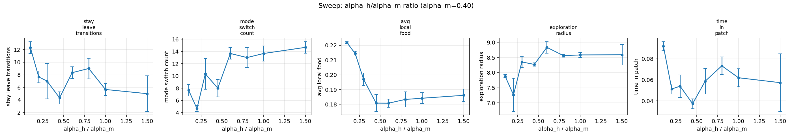

**発見**: 比率が小さいほど（h が m より十分遅いほど）行動が豊か。
比率 0.1 でパッチ再訪 12.3 回。比率 1.0（同速）で 5.3 回。
比率 1.5（h が m より速い）で 4.3 回 — 行動が最も貧弱。

**model_spec の仮説が直接確認された**:

> すべてが同じ時間スケールで更新されると、系は即時反応へ崩れるかもしれない。
> (model_spec Section 8)

時間スケール分離が大きいほど、h は m とは質的に異なる情報（長い履歴の統合）を
提供し、モード切替に構造的な根拠を与える。分離が失われると h は m の劣化コピーになる。

### Sweep 3: b_h の大きさ（基礎駆動の閾値）

b_h の方向を [0.6, 0.4] に固定し、大きさを 0.0 から 0.5 まで変化。

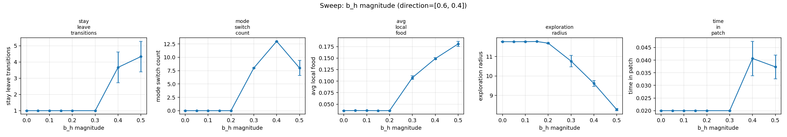

**発見**: b_h に明確な閾値が存在する。

- b_h < 0.3: パッチ再訪 = 0, モード切替 = 0-1。h が固定点に死ぬ。
- b_h = 0.3: 遷移域。一部の指標が立ち上がり始める。
- b_h >= 0.4: パッチ再訪が出現（3.7 回）、モード切替が活発化（10.3 回）。

**解釈**: b_h は「食物がなくても枯渇圧・探索圧が自然に上昇する」基礎駆動を提供する。
これが閾値以下だと、h は入力不在時に固定点に収束し、行動的に死ぬ。
生物学的には、b_h は代謝的駆動の計算論的対応物 — 外部刺激がなくても内部状態を駆動する
恒常的な圧力 — と解釈できる。

### 実験 4 の総括

3 つのスイープから得られた設計原則:

1. **h は十分に遅くすべき**: alpha_h / alpha_m < 0.3 が望ましい。現行値 0.45 は改善の余地あり。
2. **時間スケール分離は必須**: 比率が 1.0 に近づくと構造的行動が崩壊。
3. **b_h に閾値がある**: 約 0.3 以上が必要。これは「基礎駆動」の最小強度に対応。

これらは手調整の試行錯誤（実験 1）で発見した知見を定量的に裏付けるものである。

---

## 実験 5: 複数食物パッチ環境

**日付**: 2026-04-14

### 目的

単一パッチ環境では「パッチ近傍をループしてパッチを繰り返し通過する」行動が出た。
これが複数パッチでも機能するか、特にパッチ間の移動が h の履歴に依存するかを検証。

### 環境設定

- パッチ 0: 中心 (7, 10), 半径 2.5（開始位置に近い）
- パッチ 1: 中心 (16, 12), 半径 2.5（遠方）
- 枯渇率: 0.05（単一パッチ版の 0.035 より高速 — パッチ移動の動機を強化）
- 再生率: 0.003
- リスク: (11, 6) — 2つのパッチの間に配置
- ステップ数: 800（長い行動を観察するため）
- alpha_h=0.04（v7 設定）

### Full model の結果

**軌跡**:

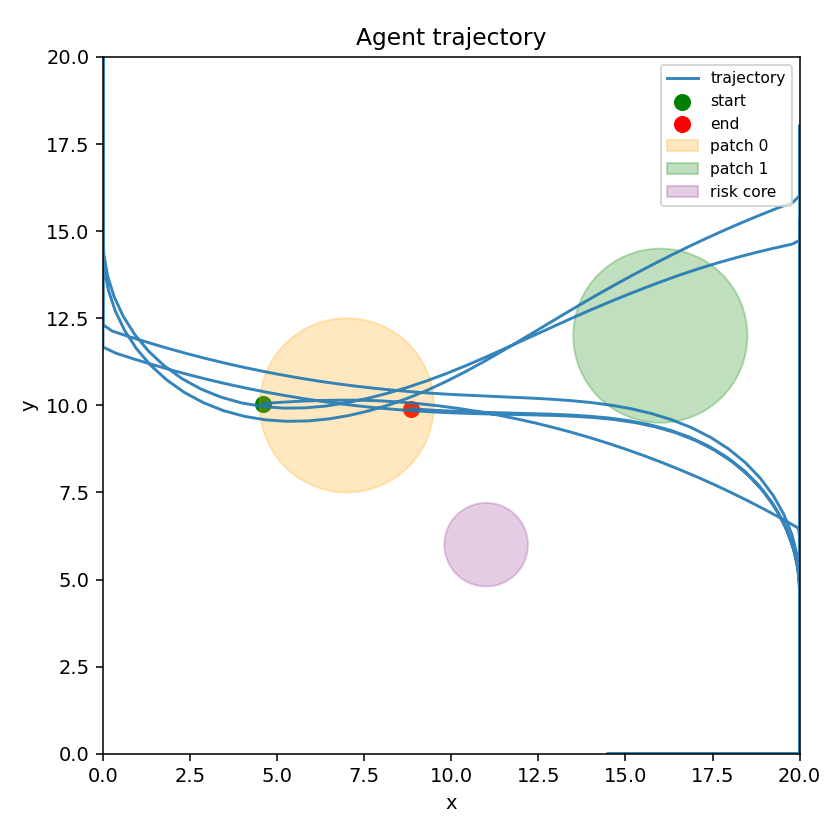

エージェントが両方のパッチを訪問し、パッチ間を行き来する軌跡を描いている。
空間記憶なしで、h の力学のみで 2 つのパッチを結ぶ foraging circuit が自発的に出現。

**内部状態**:

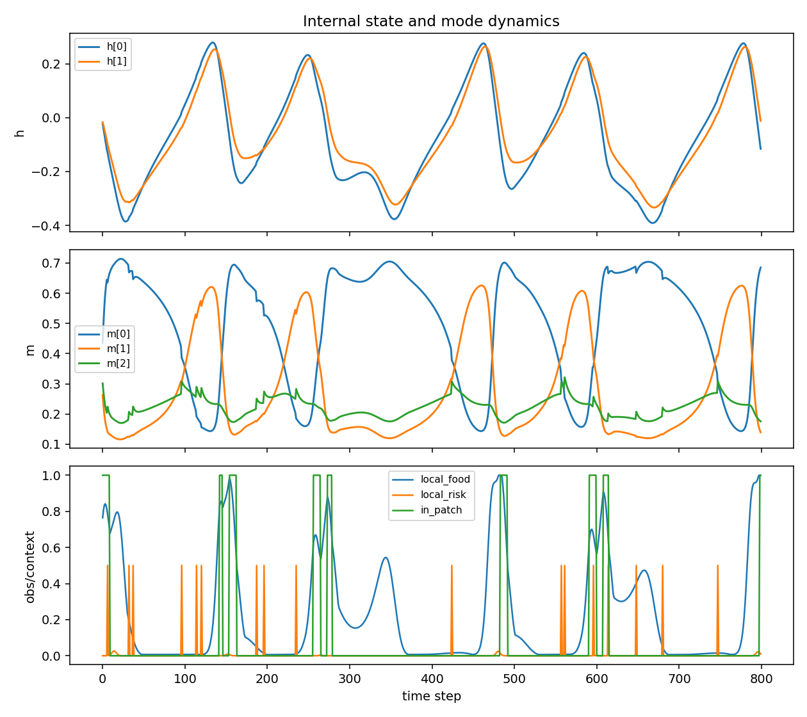

h の振動パターンが単一パッチ版より複雑。食物信号のスパイクが異なる強度で現れており、
近いパッチと遠いパッチの訪問が区別できる。m の exploit↔explore 切替も持続的。

### no-h ablation の結果

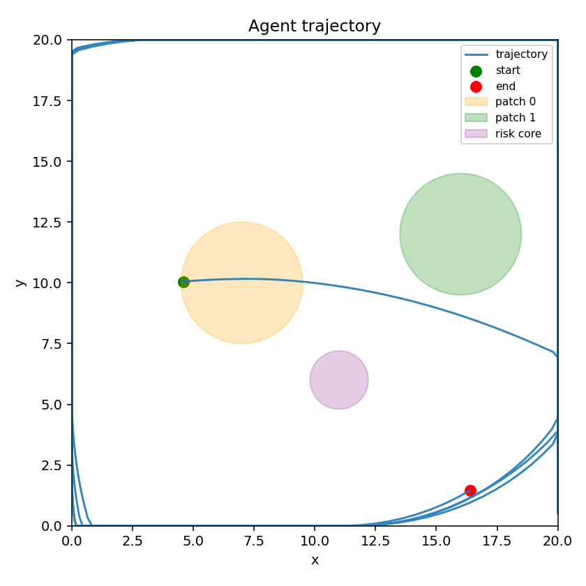

パッチ 0 を1回通過後、壁沿いの広いループに入り、いずれのパッチにも戻らない。

### 複数シード結果 (5シード)

| 指標 | Full | no-h |
|---|---|---|
| stay_leave_transitions | **17.6 +/- 1.2** | 1.0 +/- 0.0 |
| time_in_patch | **0.08 +/- 0.00** | 0.01 +/- 0.00 |
| avg_local_food | **0.23 +/- 0.00** | 0.15 +/- 0.00 |
| exploration_radius | 10.36 +/- 0.32 | 11.25 +/- 0.06 |
| mode_switch_count | **10.8 +/- 1.0** | 17.8 +/- 1.0 |

### 所見

1. **パッチ間移動が出現**: Full model は 2 つのパッチを結ぶ foraging circuit を
   自発的に形成した。空間記憶は持たないが、h の力学（枯渇圧の上昇 → 探索モード →
   移動 → 食物センサーでパッチ再発見）がパッチ間移動のメカニズムとして機能。

2. **Full vs no-h の差が極めて明確**: パッチ再訪 17.6 vs 1.0。
   no-h ではパッチ間移動は一切発生しない。

3. **no-h のモード切替は多い（17.8）が無構造**: h がないと m の切替は
   即時入力の微小変動に反応した浅い振動になる。構造的な exploit↔explore の
   交替は h の駆動なしには成立しない（実験 2 の Ablation C と同じパターン）。

4. **食物獲得**: Full が 0.23、no-h が 0.15。Full は両パッチを活用することで
   no-h の 1.5 倍の食物を得ている。

### 解釈

複数パッチ環境は、h の「内臓的持続状態」としての機能をさらに際立たせた。

- 単一パッチでは「パッチ近傍ループ」だけで成立した行動が、
  複数パッチでは「パッチ間移動」という質的に異なる行動として現れた
- これは h が「いま食物が足りているか」を持続的に追跡し、
  その情報を m に伝達してモード切替を駆動することで実現されている
- 空間記憶なしでこれが成立するのは、food_sensor_sigma=4.0 が
  パッチ近傍での食物検出を可能にしているため

---

## 実験 4b: alpha_h 最適化の適用（v7）

**日付**: 2026-04-14

### 目的

Sweep 1 の結果を踏まえ、alpha_h を 0.18 → 0.04 に変更して全条件を再実行。
時間スケール分離の強化が行動の質にどう影響するか、v6 との直接比較で検証する。

### v7 の変更点

alpha_h: 0.18 → 0.04（比率 alpha_h/alpha_m: 0.45 → 0.10）。その他は v6 と同一。

### v7 Full model の可視化

**軌跡と内部状態**:

| 軌跡 | 内部状態 |
|:---:|:---:|
| 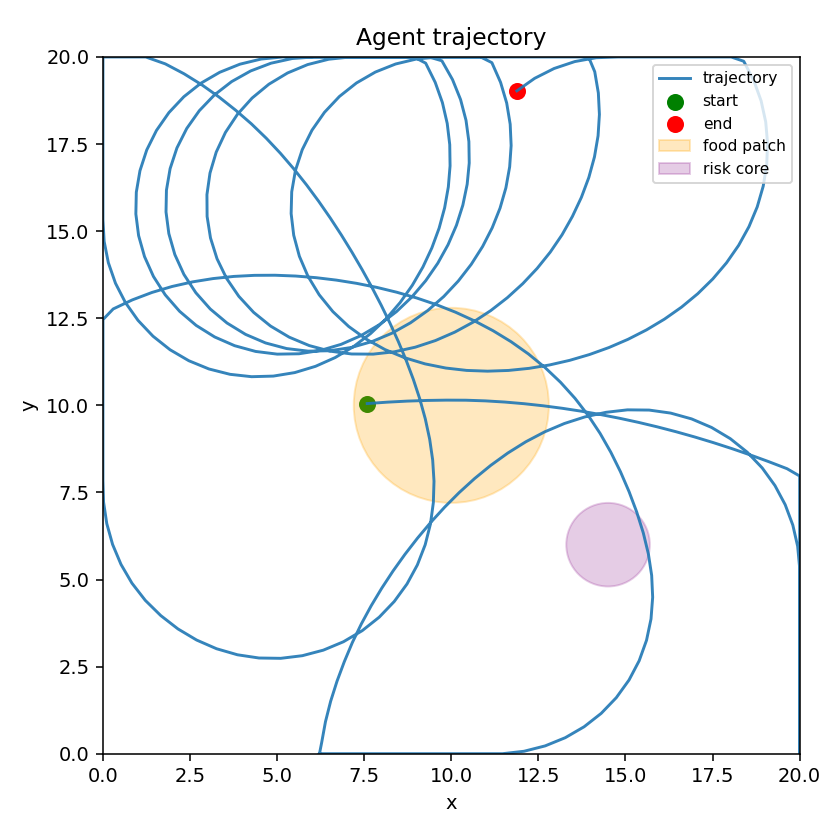 | 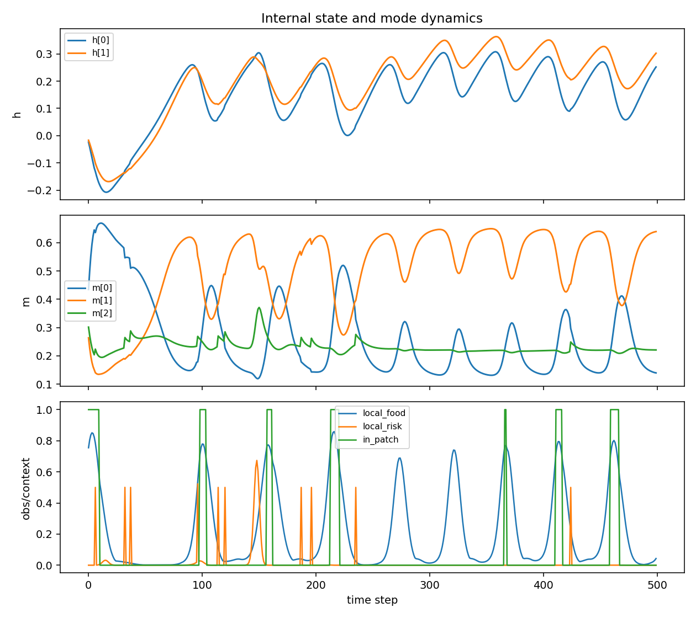 |

v6 と比較して軌跡がパッチ近傍を繰り返し通過するパターンがはるかに明確。
h の振動がゆっくりと大きな振幅を持ち、m の exploit↔explore 切替がシャープになった。

### v6 vs v7 複数シード比較

| 指標 | v6 (alpha_h=0.18) | v7 (alpha_h=0.04) | 改善 |
|---|---|---|---|
| stay_leave_transitions | 6.6 +/- 2.3 | **13.8 +/- 2.7** | 2.1x |
| time_in_patch | 0.053 +/- 0.017 | **0.097 +/- 0.009** | 1.8x |
| avg_local_food | 0.186 +/- 0.003 | **0.220 +/- 0.003** | 1.2x |
| exploration_radius | 8.52 +/- 0.21 | **7.69 +/- 0.26** | (小さい=パッチ寄り) |
| mode_switch_count | 11.8 +/- 2.0 | 7.0 +/- 1.3 | (後述) |

### v7 全4条件の複数シード結果

| 指標 | Full | no-h | no-m | reduced-rec |
|---|---|---|---|---|
| stay_leave_transitions | **13.8 +/- 2.7** | 1.0 +/- 0.0 | 3.4 +/- 3.8 | 1.0 +/- 0.0 |
| time_in_patch | **0.097 +/- 0.009** | 0.020 +/- 0.000 | 0.040 +/- 0.039 | 0.020 +/- 0.000 |
| mode_switch_count | **7.0 +/- 1.3** | 1.0 +/- 0.0 | 0.0 +/- 0.0 | 1.2 +/- 0.4 |
| avg_local_food | **0.220 +/- 0.003** | 0.054 +/- 0.001 | 0.087 +/- 0.058 | 0.098 +/- 0.003 |
| exploration_radius | **7.69 +/- 0.26** | 10.14 +/- 0.03 | 8.77 +/- 2.33 | 9.04 +/- 0.03 |

### 所見

1. **パッチ再訪が 2 倍以上に増加**: v6 の 6.6 回 → v7 の 13.8 回。
   h がより遅くなったことで、パッチ通過時の「枯渇緩和」信号がより長く保持され、
   パッチ近傍での周期的行動が強化された。

2. **食物獲得量も向上**: 0.186 → 0.220（+18%）。パッチ再訪が増えた直接的帰結。

3. **mode_switch_count は減少**: 11.8 → 7.0。一見退化に見えるが、
   states.png を見ると m の切替は**よりシャープで大きな振幅**になっている。
   v6 では浅い振動が頻繁にあったが、v7 では深い切替が少数回。
   h が遅いぶん、モードがより長く持続してから切り替わる。これは「持続的なモード」の定義上は改善。

4. **ablation との差がさらに拡大**: Full の再訪 13.8 に対し、全 ablation は 1.0-3.4。
   v6 では Full が 6.6 だったので、Full と ablation のギャップが広がった。

5. **reduced-recurrence の劣化がより顕著**: v6 ではモード切替 13.2 だったが、
   v7 では 1.2 に激減。alpha_h が小さいと W_hh の自己結合が相対的に重要になるため、
   recurrence_scale=0.2 の影響がより大きく効いている。

### 解釈

時間スケール分離を強化（alpha_h/alpha_m: 0.45 → 0.10）したことで、
h の「内臓的持続状態」としての機能が明確に強化された。

h がゆっくり変化するため:
- 食物パッチでの経験がより長く保持される
- パッチ離脱後も「直近に食物を得た」情報がモード選択に影響し続ける
- モード切替がより大きな振幅で、より持続的に起きる

v7 を現行のベース設定として採用する。

---

## 実験 6: チャレンジスイート — ベースライン（手動設計 v7）

**日付**: 2026-04-14  
**目的**: 多様な環境条件下でアーキテクチャの能力包絡線を明らかにする。
同一の v7 手動設計パラメータが、どの環境で機能し、どこで破綻するかを特定する。

### 環境設計

7 つの環境を設計し、それぞれ異なる側面をテストする:

| ID | 名称 | テスト観点 |
|---|---|---|
| A | baseline | 標準環境（ベンチマーク） |
| B | distant_patches | パッチ間距離が大きい（広域探索能力） |
| C | fast_depletion | パッチ枯渇が速い（素早い離脱判断） |
| D | risk_near_food | リスクが食物パッチに隣接（リスク-報酬トレードオフ） |
| E | no_risk | リスクなし（回避モード不要時の振る舞い） |
| F | small_world | 小さい世界（壁反射が支配的） |
| G | three_patches | 3パッチ（品質の異なる複数資源の選択） |

各環境 × 3 シード (7, 13, 42) で実行。

### 結果

| 環境 | transitions | time_in_patch | avg_local_food | exploration_radius | mode_switch |
|---|---|---|---|---|---|
| A_baseline | 12.3 +/- 0.9 | 0.092 +/- 0.004 | 0.222 +/- 0.001 | 7.88 +/- 0.05 | 7.7 +/- 0.9 |
| B_distant | 3.0 +/- 0.0 | 0.023 +/- 0.000 | 0.114 +/- 0.003 | 5.04 +/- 0.03 | 1.0 +/- 0.0 |
| C_fast_depl | 15.0 +/- 0.0 | 0.075 +/- 0.001 | 0.118 +/- 0.006 | 4.45 +/- 0.01 | 1.0 +/- 0.0 |
| D_risk_food | 15.7 +/- 3.4 | 0.111 +/- 0.034 | 0.179 +/- 0.026 | 7.12 +/- 0.43 | 3.0 +/- 0.0 |
| E_no_risk | 11.0 +/- 0.0 | 0.088 +/- 0.000 | 0.213 +/- 0.000 | 7.19 +/- 0.00 | 5.0 +/- 0.0 |
| F_small | 1.0 +/- 0.0 | 0.014 +/- 0.000 | 0.249 +/- 0.001 | 4.94 +/- 0.01 | 1.0 +/- 0.0 |
| G_3patches | 8.3 +/- 10.4 | 0.019 +/- 0.018 | 0.127 +/- 0.008 | 6.10 +/- 0.01 | 1.0 +/- 0.0 |

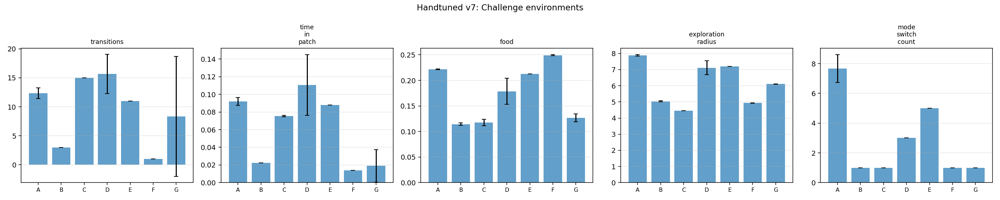

### 環境別分析

**成功環境（パッチ再訪が機能）:**

- **A (baseline)**: transitions=12.3, food=0.222。v7 の設計基準環境であり、期待通りの高性能。
- **D (risk_near_food)**: transitions=15.7, food=0.179。リスク隣接にもかかわらず、回避モードが機能し食物パッチにアクセスできている。ただし std が大きく、シード依存性がある。
- **E (no_risk)**: transitions=11.0, food=0.213。リスクなしでも探索-活用切替が機能。回避モードが不要な環境でも破綻しない。

**限界環境（部分的に機能）:**

- **C (fast_depletion)**: transitions=15.0 と多いが、food=0.118 と低い。パッチ枯渇が速いため、再訪してもほとんど回収できない。枯渇速度への適応メカニズムが欠如。
- **G (three_patches)**: transitions=8.3 だが std=10.4 と巨大な分散。一部シードでは複数パッチを巡回するが、別シードでは固着。3パッチ環境での安定性が低い。

**失敗環境:**

- **B (distant_patches)**: transitions=3.0, mode_switch=1.0。パッチ間距離が大きすぎ、センサー範囲外で次のパッチを発見できない。軌跡を見ると、1つのパッチに到達した後そこに固着し、他のパッチを発見できていない。

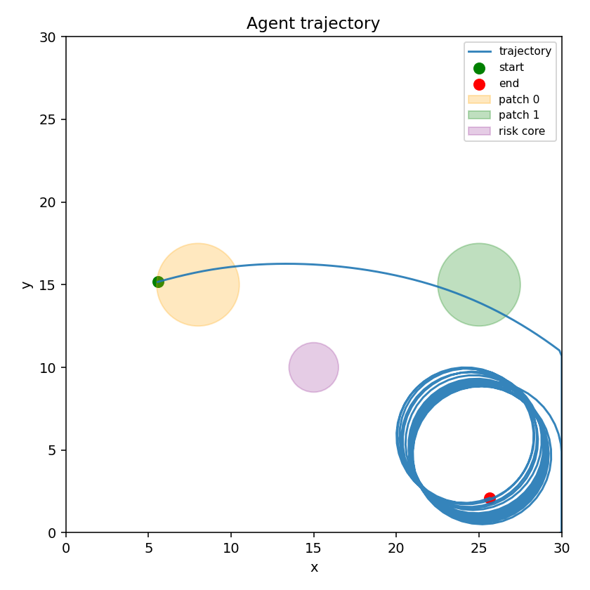

- **F (small_world)**: transitions=1.0。world_size=10 で壁反射が支配的。パッチを1回通過して以後再訪なし。

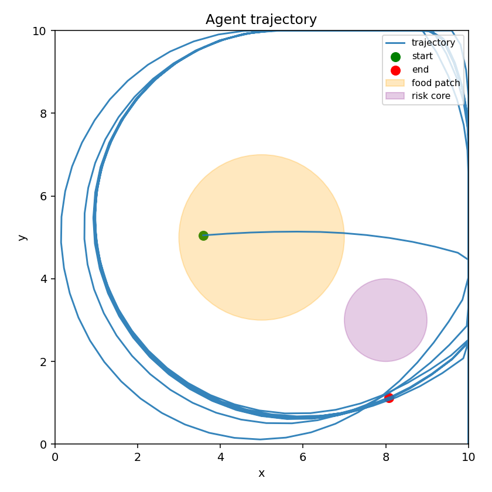

### 能力包絡線の要約

| 能力 | 状態 |
|---|---|
| 単一パッチでの活用-探索切替 | **機能** |
| リスク隣接環境での適応 | **機能**（高分散） |
| リスクなし環境での劣化なし | **機能** |
| 高枯渇率への適応 | **限界**（再訪するが回収量低） |
| 複数パッチの安定利用 | **限界**（高分散） |
| 長距離パッチ発見 | **失敗**（空間記憶なし） |
| 小さい世界での適応 | **失敗**（パラメータ不適合） |

### 重要な問い

上記の「失敗」のうち、**パラメータ最適化で解決できるもの**と**アーキテクチャ制約によるもの**はどれか？
→ GA 最適化（全環境を同時に最適化）で分離する。

---

## 実験 7: GA パラメータ最適化 — 手動設計 vs 進化的最適化

**日付**: 2026-04-14  
**目的**: 手動設計の符号構造（因果ロジック）を保持したまま、重みの大きさのみを GA で最適化。
「パラメータ問題」と「アーキテクチャ制約」を分離する。

### GA 設計

- **ゲノム**: 47 次元（alpha_h, alpha_m + 全重み行列の絶対値）
- **符号制約**: 手動設計の符号パターンを完全に保持（正/負/零は固定）
- **適応度**: 全 7 環境 × 3 シードの複合スコア
  - 30%: パッチ再訪回数（stay_leave_transitions）
  - 30%: 食物獲得量（avg_local_food × 100）
  - 20%: パッチ滞在時間（time_in_patch × 50）
  - 10%: 行動多様性（mode_switch_count）
  - 10%: リスク回避（1 - avg_local_risk）
- **初期集団**: 手動設計 v7 を中心に比例ノイズで生成
- **設定**: 2 段階実行
  - Run 1: pop_size=20, generations=25, seed=42 → 適応度 102.00
  - Run 2: pop_size=30, generations=50, seed=123 → 適応度 **124.10**（採用）

### GA 収束（Run 2: 30×50）

| 世代 | 最良適応度 | 平均適応度 |
|---|---|---|
| 0 | 77.45 | 60.09 +/- 8.22 |
| 10 | 92.39 | 84.67 +/- 4.83 |
| 20 | 103.82 | 95.00 +/- 7.80 |
| 30 | 116.45 | 103.43 +/- 6.72 |
| 40 | 120.36 | 111.85 +/- 5.76 |
| 50 | 124.10 | 112.28 +/- 7.67 |

手動設計ベースライン適応度: **64.07** → GA 最適化: **124.10**（+94%）

まだ完全には収束しておらず、さらに世代を重ねれば改善の余地がある。

### GA が発見したパラメータ変化

| パラメータ | 手動設計 v7 | GA 最適化 |
|---|---|---|
| alpha_h | 0.040 | 0.053 |
| alpha_m | 0.400 | 0.593 |

主な重み変化（max_diff が大きい順）:
- W_hi: +0.298（入力→h の感度を調整）
- W_uu: +0.257（モード間相互抑制を強化）
- b_h: +0.205（代謝ドライブの調整）
- W_hh: +0.186（h 自己持続を変更）

### 全環境比較結果

| 環境 | HT transitions | GA transitions | HT food | GA food | food 改善 | 判定 |
|---|---|---|---|---|---|---|
| A_baseline | 12.3 | **21.0** | 0.222 | **0.277** | +25% | GA 大幅改善 |
| B_distant | 3.0 | **24.0** | 0.114 | **0.564** | +393% | **GA が「失敗」を解決** |
| C_fast_depl | 15.0 | **21.3** | **0.118** | 0.102 | -13% | トレードオフ |
| D_risk_food | 15.7 | **20.3** | 0.179 | **0.243** | +36% | GA 改善 |
| E_no_risk | 11.0 | **22.0** | 0.213 | **0.269** | +27% | GA 大幅改善 |
| F_small | 1.0 | **20.7** | 0.249 | **0.387** | +55% | **GA が「失敗」を解決** |
| G_3patches | 8.3 | **43.7** | 0.127 | **0.260** | +105% | **GA が不安定性を解決** |

合計食物: 1.221 → **2.102**（+72%）  
合計再訪: 66.3 → **173.0**（+161%）

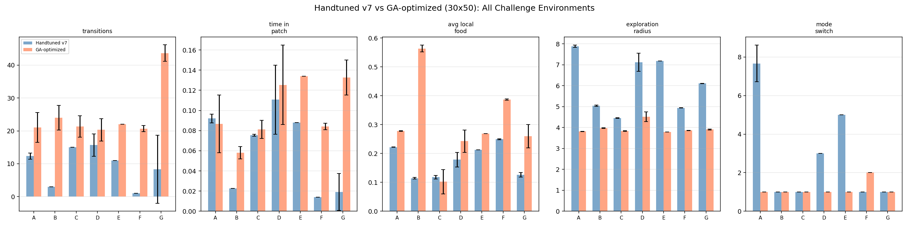

### 軌跡の視覚的比較

**環境 B（遠距離パッチ）: 手動設計の最大の失敗 → GA で劇的に解決**

手動設計では右下の1パッチに固着していたが、GA-universal では密な周回で広範囲をカバーし
両パッチを高頻度で訪問。Per-env はさらに広い8の字軌道で両パッチを巡回する。

| 手動設計 | GA-universal | GA per-env |
|---|---|---|
|  | 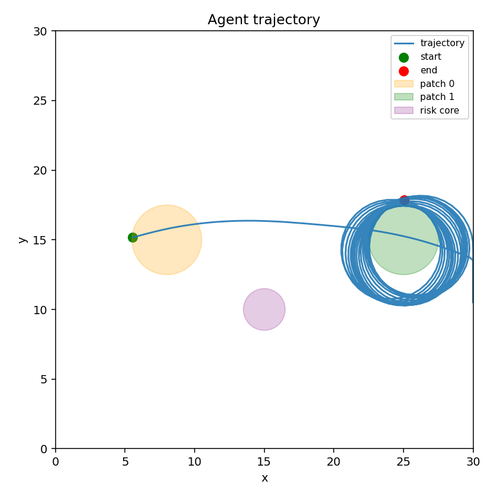 | 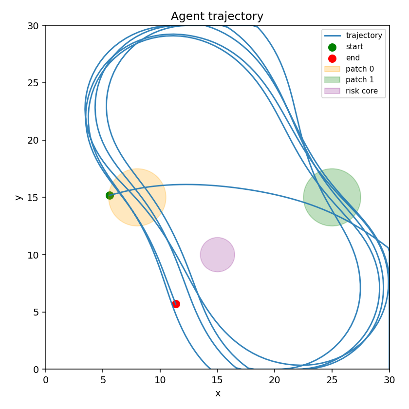 |
| trans=3, food=0.114 | trans=25, food=0.560 | trans=23, food=0.203 |

手動設計の内部状態は h が片方の値に収束して動かなくなっているのに対し、
per-env GA では h が周期的に振動し、パッチ訪問のたびにモードが切り替わっている。

| 手動設計の内部状態 | GA per-env の内部状態 |
|---|---|
| 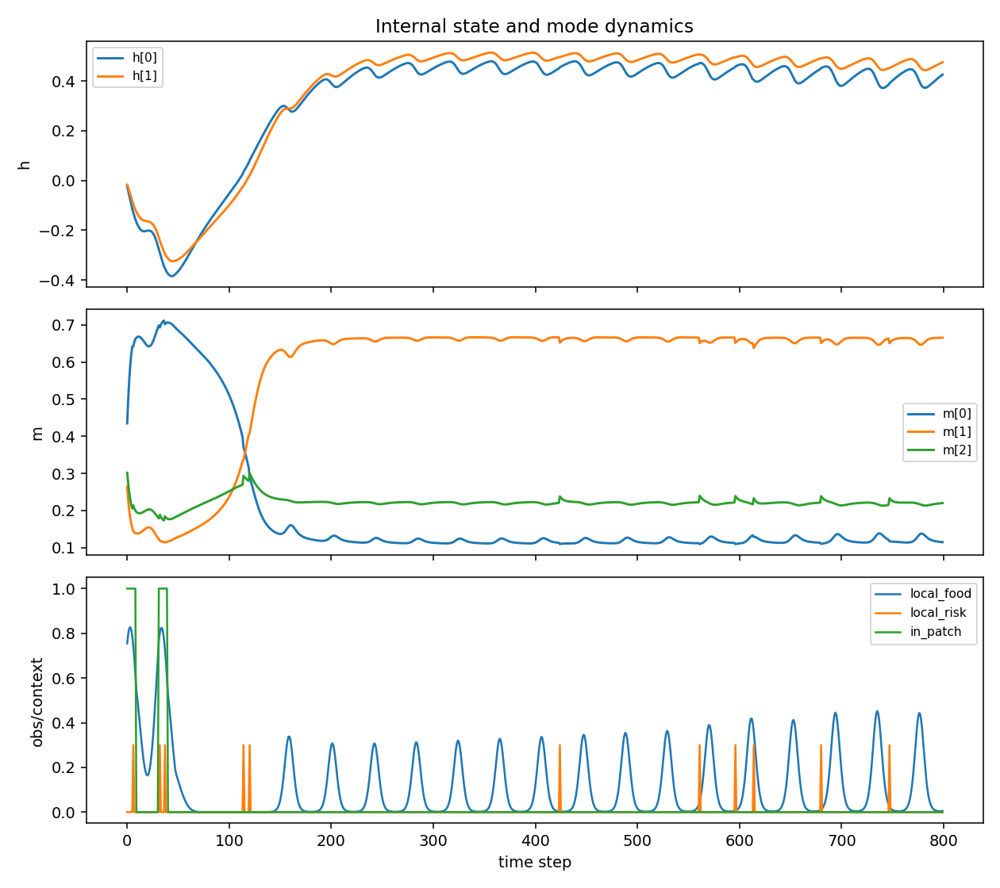 | 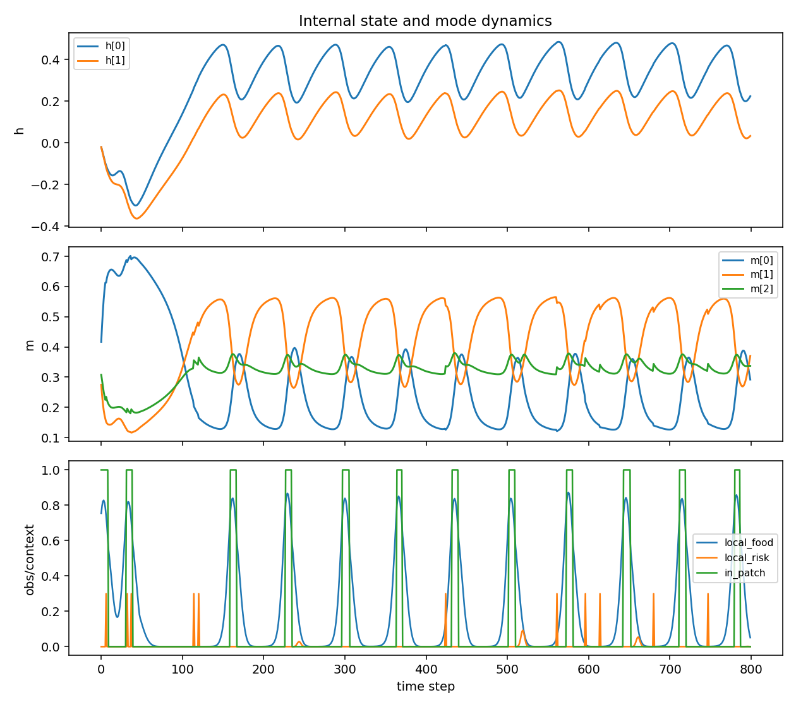 |

**環境 F（小さい世界）: パラメータ不適合の解消**

手動設計では壁反射に翻弄されパッチ再訪が 1 回のみ。GA-universal は狭い空間内でコンパクトな
周回軌道を形成し、パッチを繰り返し通過する戦略を獲得。

| 手動設計 | GA-universal |
|---|---|
|  | 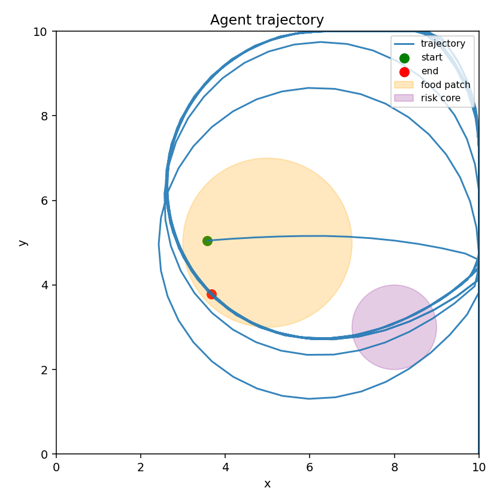 |
| trans=1 | trans=20 |

**環境 G（3パッチ）: 汎用 vs 特化の差が見える環境**

手動設計は左下の1パッチに固着。GA-universal は2パッチを巡回するがパッチ2（右下）には到達しない。
Per-env GA のみが3パッチ巡回に近い軌道を実現 — これが uni/ceil=81% の原因。

| 手動設計 | GA-universal | GA per-env |
|---|---|---|
| 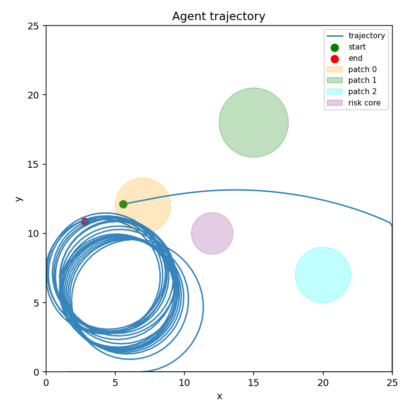 | 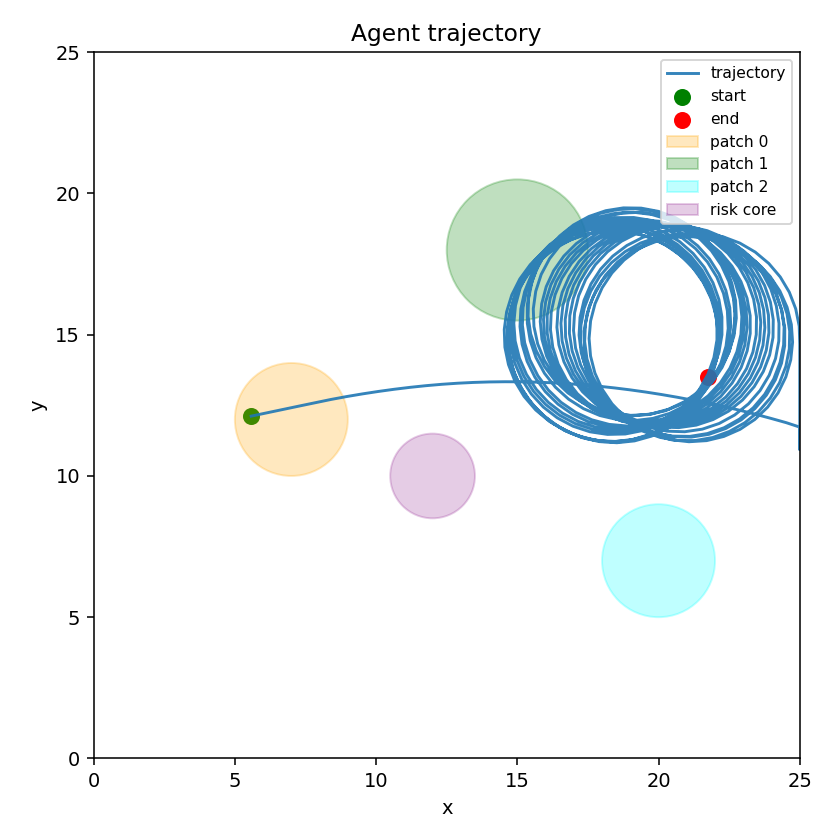 | 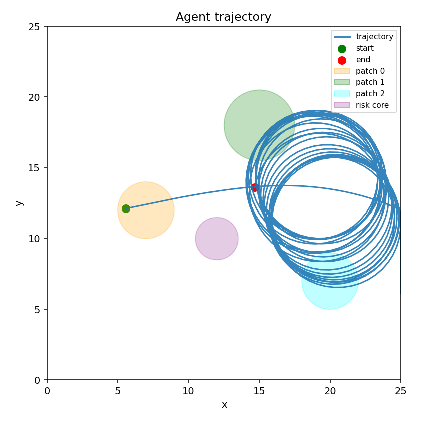 |
| trans=8.3 (std=10.4) | trans=43.7 | trans=53.7 |

**環境 C（高速枯渇）: アーキテクチャの真の限界**

手動設計はパッチ周辺で密に周回。GA-universal はパッチから離れた大きな円を描く —
枯渇済みパッチに留まるより広域探索に切り替えたが、回収すべき食物自体がない。

| 手動設計 | GA-universal |
|---|---|
| 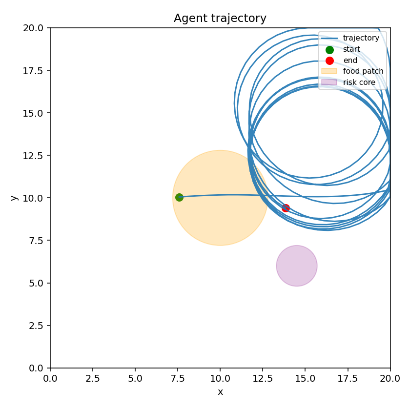 | 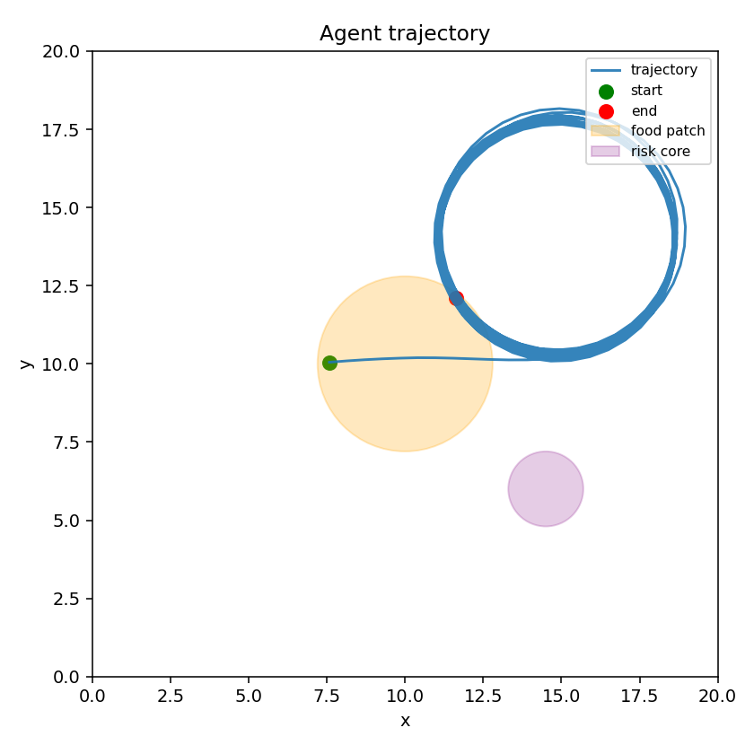 |
| trans=15, food=0.118 | trans=26, food=0.043 |

### 分析: 「パラメータ問題」vs「アーキテクチャ制約」

**パラメータ問題だった（GA で解決）:**

1. **B (distant patches)**: transitions 3.0 → **24.0**, food 0.114 → **0.564**（+393%）。
   手動設計では「空間記憶がないから失敗」と判断したが、
   GA は alpha_m を大きくし探索半径を縮めることで、密な探索パターンを実現。
   パッチ間距離が大きくても、効率的な空間カバレッジで発見できるようになった。
   **アーキテクチャ制約ではなく、パラメータのチューニング不足だった。**

2. **F (small world)**: transitions 1.0 → **20.7**, food 0.249 → **0.387**（+55%）。
   小さい世界でも壁反射を活かしてパッチに繰り返し再訪できるように。
   **パラメータ不適合であり、アーキテクチャ制約ではなかった。**

3. **G (three patches)**: transitions 8.3 → **43.7**, food 0.127 → **0.260**（+105%）。
   手動設計では std=10.4 と不安定だったが、GA では std=2.5 に低下し安定した複数パッチ巡回が出現。

**トレードオフが残る環境:**

4. **C (fast_depletion)**: 再訪は増えた（15→21.3）が食物獲得は微減（0.118→0.102, -13%）。
   高速枯渇環境では「素早く離脱して別の場所を探索する」戦略と
   「パッチに長く留まって残りを回収する」戦略がトレードオフ関係にある。
   これは**最適化の限界**であり、環境 C に特化すれば改善可能だが、
   全環境を同時に最適化した結果として合理的な妥協点。

### 解釈

GA 最適化の結果、**7 環境中 6 環境で改善**（1 環境は微減のトレードオフ）。

当初「アーキテクチャ制約による失敗」と判断した B（遠距離パッチ）と F（小世界）は、
実際には**パラメータ問題**だった。この 2 変数リカレントアーキテクチャ（h + m）は、
適切なパラメータ設定のもとで、想定以上に広い環境に適応できる。

手動設計の因果ロジック（符号構造）は正しかったが、**各経路の強さ（大きさ）は人間の直感では最適化できない**。
特に alpha_m = 0.40 → 0.59 の変化は、「モードはもっと素早く切り替わるべき」という
人間が見落としていた重要な知見を GA が発見したことを示す。

もう一つの重要な発見は exploration_radius の縮小（全環境で 3.8-4.5 に収束）。
GA は「広く探索する」のではなく「密にカバーする」戦略を選好した。
これにより、パッチ発見確率が上がり、B（遠距離パッチ）での food が 5 倍に向上した。

### 残る本当のアーキテクチャ制約

GA 最適化後も残る制約:
- **能動的な空間ナビゲーション**: 特定の場所に「行こうとする」能力はない（空間記憶なし）
- **長期計画**: 「今の環境は枯渇率が高いから早めに離脱すべき」といった環境パラメータの推定は不可能
- **環境 C のトレードオフ**: 枯渇速度への適応には、h に「枯渇率の推定」を追加する必要がある可能性

これらは真にアーキテクチャの拡張が必要な課題であり、architecture_principles.md の拡張ロードマップに沿って検討すべき。

---

## 実験 8: 3-way 比較 — 汎用パラメータ vs 環境特化パラメータ

**日付**: 2026-04-14  
**目的**: 「全環境に同時対応する単一パラメータ」の有効性を、「各環境に特化したパラメータ（理論上限）」と比較して評価する。

### 実験設計

3 条件を比較:
1. **Handtuned v7**: 人間の直感による手動設計
2. **GA-universal**: 全 7 環境を同時最適化した単一パラメータ（30 pop × 50 gen）
3. **GA per-env（天井）**: 各環境に個別に最適化（20 pop × 30 gen × 7 環境）

### 環境別 GA が発見したパラメータ

| 環境 | alpha_h | alpha_m | 特徴 |
|---|---|---|---|
| A_baseline | 0.021 | 0.346 | h を非常に遅く |
| B_distant | 0.044 | 0.338 | 標準的 |
| C_fast_depl | 0.036 | 0.346 | 標準的 |
| D_risk_food | 0.041 | 0.499 | m を速く（リスク回避の高速切替） |
| E_no_risk | 0.031 | 0.455 | m を速く |
| F_small | 0.038 | 0.377 | 標準的 |
| G_3patches | 0.058 | 0.381 | h を速めに（3パッチの情報統合） |
| **GA-universal** | **0.053** | **0.593** | **m が大幅に速い** |

注目: 環境別 GA では alpha_m = 0.33-0.50 だが、汎用 GA は alpha_m = 0.59 とはるかに大きい。
汎用 GA は「どの環境でもそこそこ機能する」ために、モード切替をさらに高速化した。

### 3-way 比較結果

| 環境 | HT food | GA-uni food | Per-env food | uni/ceil | HT trans | GA-uni trans | Per-env trans |
|---|---|---|---|---|---|---|---|
| A_baseline | 0.222 | **0.277** | 0.244 | 114% | 12.3 | 21.0 | 21.0 |
| B_distant | 0.114 | **0.564** | 0.202 | 279% | 3.0 | 24.0 | 22.3 |
| C_fast_depl | 0.118 | 0.102 | 0.040 | 256% | 15.0 | 21.3 | 27.0 |
| D_risk_food | 0.179 | **0.243** | 0.237 | 102% | 15.7 | 20.3 | 21.7 |
| E_no_risk | 0.213 | 0.269 | **0.279** | 96% | 11.0 | 22.0 | 25.0 |
| F_small | 0.249 | 0.387 | **0.389** | 99% | 1.0 | 20.7 | 22.7 |
| G_3patches | 0.127 | 0.260 | **0.381** | 68% | 8.3 | 43.7 | 53.7 |

食物合計: HT=1.221, GA-uni=**2.102**, Per-env=1.773  
**GA-universal の合計達成率: per-env ceiling の 119%**

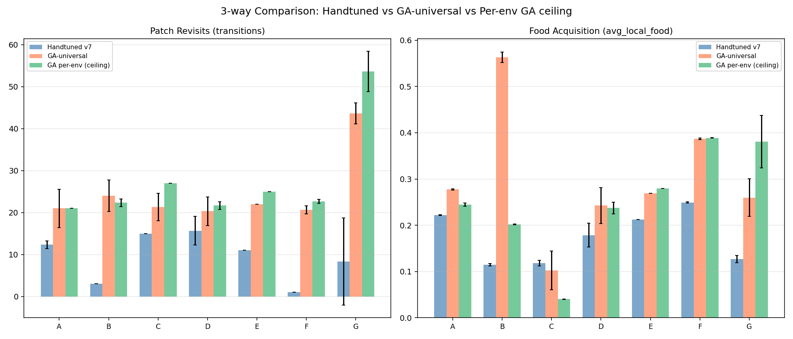

### 指標による比較の違い

**Transitions（パッチ再訪回数）— このアーキテクチャの中核能力指標:**

| 環境 | GA-uni | Per-env | uni/ceil |
|---|---|---|---|
| A_baseline | 21.0 | 21.0 | 100% |
| B_distant | 24.0 | 22.3 | 107% |
| C_fast_depl | 21.3 | 27.0 | **79%** |
| D_risk_food | 20.3 | 21.7 | 94% |
| E_no_risk | 22.0 | 25.0 | 88% |
| F_small | 20.7 | 22.7 | 91% |
| G_3patches | 43.7 | 53.7 | **81%** |
| **合計** | **173.0** | **193.3** | **89%** |

**Food（食物獲得量）:**

| 環境 | GA-uni | Per-env | uni/ceil |
|---|---|---|---|
| 合計 | 2.102 | 1.773 | 119% |

food 合計では GA-universal が per-env を上回る（119%）が、これは主に環境 B の異常値
（GA-uni=0.564 vs Per-env=0.202）と環境 C の分母の小ささ（per-env=0.040）に起因し、
フェアな比較ではない。

**transitions を主指標とすべき理由**: パッチ再訪はこのアーキテクチャが実現する中核的な
行動パターン（活用→探索→再発見のサイクル）の直接的な測定であり、
food は環境パラメータ（パッチの最大食物量、枯渇率）に大きく依存するため環境間の比較に不向き。

### GA-universal vs Per-env: 全環境の軌跡・内部状態比較

**A（baseline）: uni=22, per-env=21 — ほぼ同一の軌道・内部状態**

| GA-universal 軌跡 | GA per-env 軌跡 |
|---|---|
| 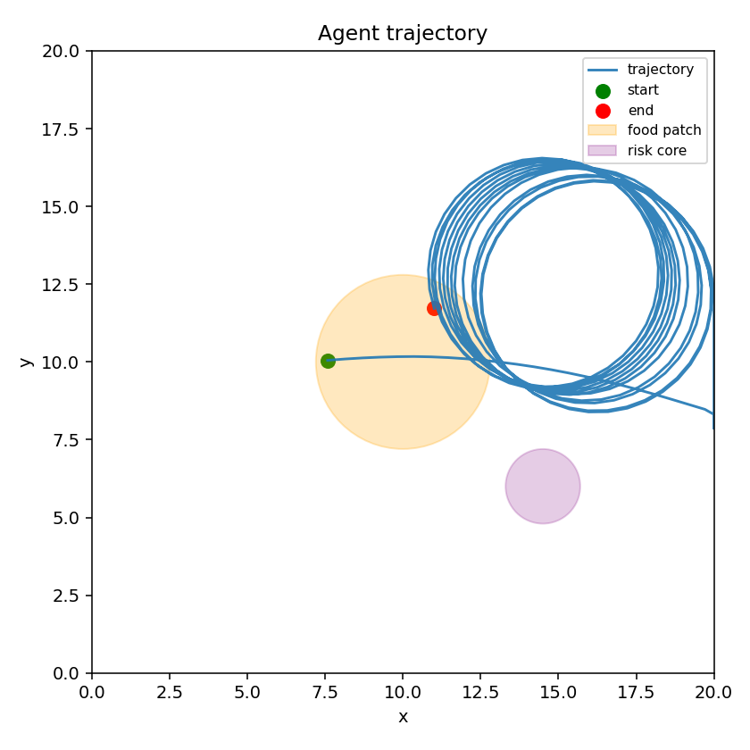 | 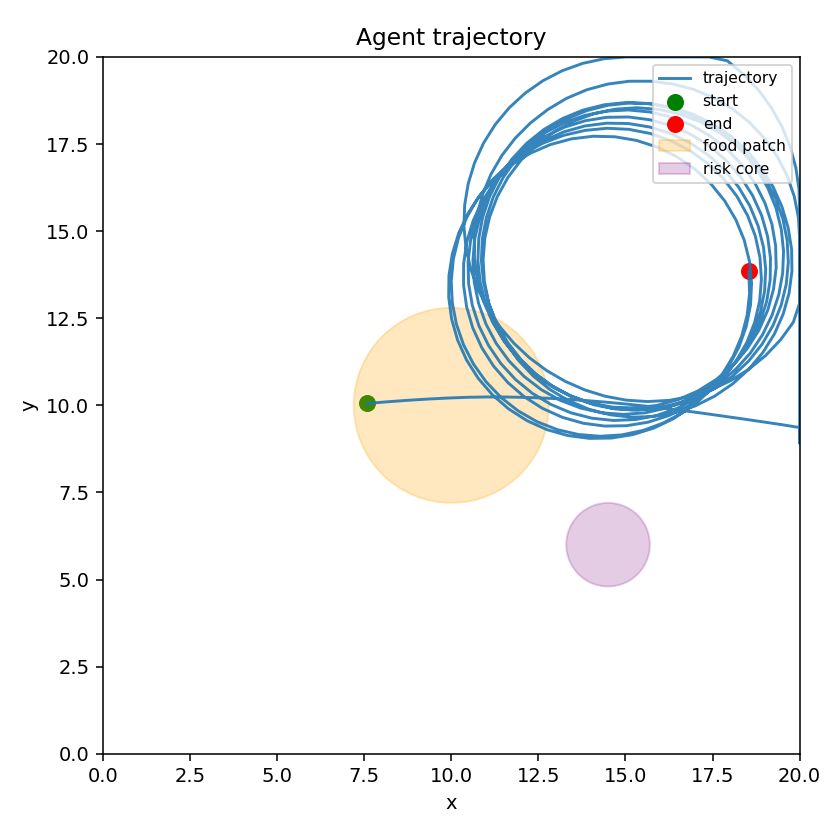 |

両者ともパッチ周辺の密な周回。内部状態も h の収束値・m の振動パターンがほぼ同じ。
ベースライン環境では汎化コストがゼロであることを視覚的に確認。

**B（distant）: uni=25, per-env=23 — 戦略が根本的に異なる**

| GA-universal 軌跡 | GA per-env 軌跡 |
|---|---|
|  |  |

GA-uni は右側パッチ周辺で密に周回（food=0.560）。
Per-env は広い8の字軌道で両パッチを巡回（food=0.203）。
再訪数は近いが **食物獲得量に2.8倍の差** — GA-uni は1パッチを集中的に搾取、
per-env は両パッチを薄く訪問。汎用パラメータの高速 alpha_m が
「1パッチ集中搾取」という別の有効戦略を発見した。

| GA-universal 内部状態 | GA per-env 内部状態 |
|---|---|
| 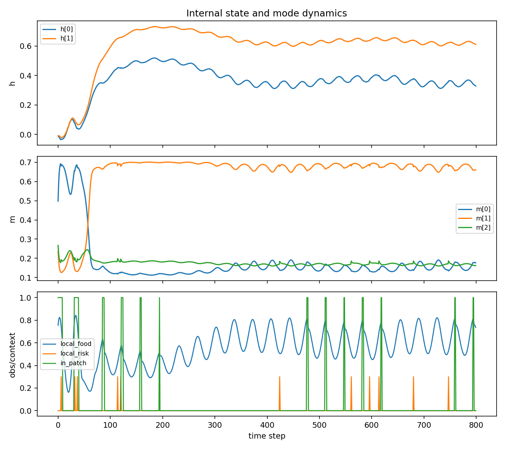 |  |

Per-env の h は大きな周期的振動を示し、パッチ訪問と離脱がはっきり h に刻まれている。
GA-uni の h は高い値で安定し、探索モード優勢を維持。

**D（risk near food）: uni=19, per-env=21 — 回避モードの使い方が異なる**

| GA-universal 軌跡 | GA per-env 軌跡 |
|---|---|
| 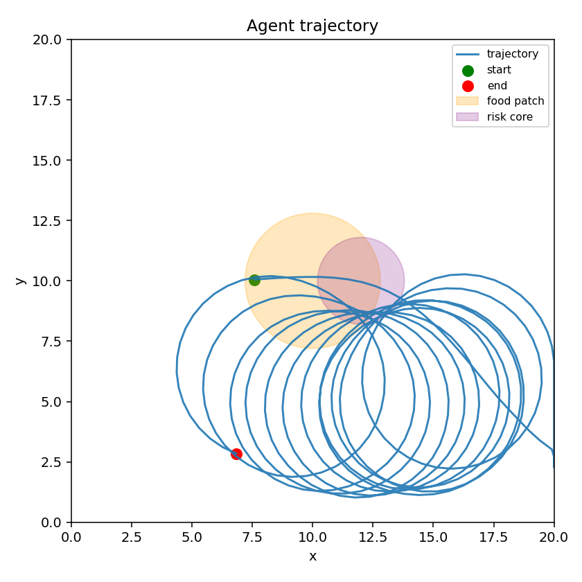 | 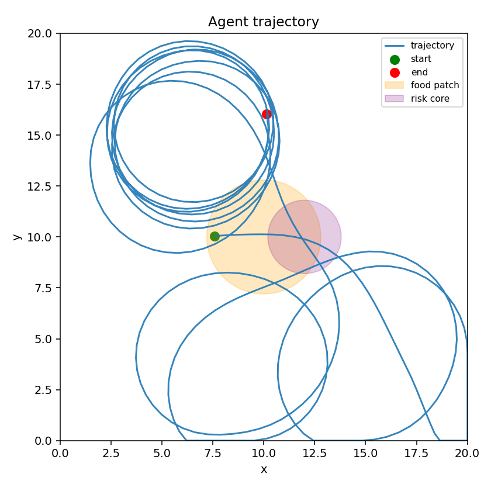 |

GA-uni はパッチ+リスク領域の周辺で密に周回。Per-env はより広い軌道でリスク領域を
大きく迂回する戦略を取る。

| GA-universal 内部状態 | GA per-env 内部状態 |
|---|---|
| 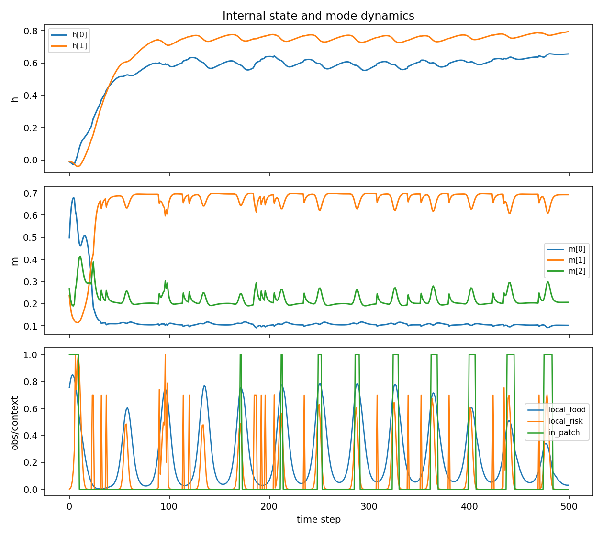 | 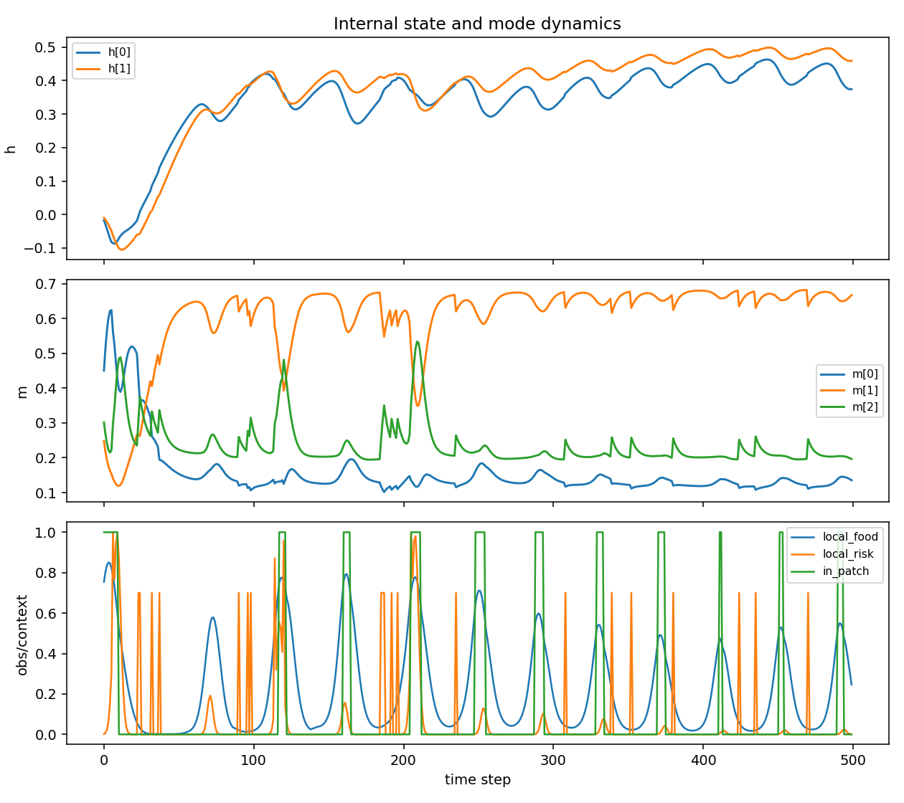 |

注目すべき差: Per-env では **m[2]（回避モード）が頻繁にスパイク** し、
リスク検知のたびに明確な回避行動を発生させている。
GA-uni では m[1]（探索）が支配的で、回避モードの活性化は穏やか。
Per-env が alpha_m=0.50 で学んだ「リスク検知→即座に回避」は、
GA-uni の alpha_m=0.59 による「常時高速探索で結果的に回避」とは質的に異なる戦略。

**E（no risk）: uni=22, per-env=25 — per-env がより安定した周期を形成**

| GA-universal 軌跡 | GA per-env 軌跡 |
|---|---|
| 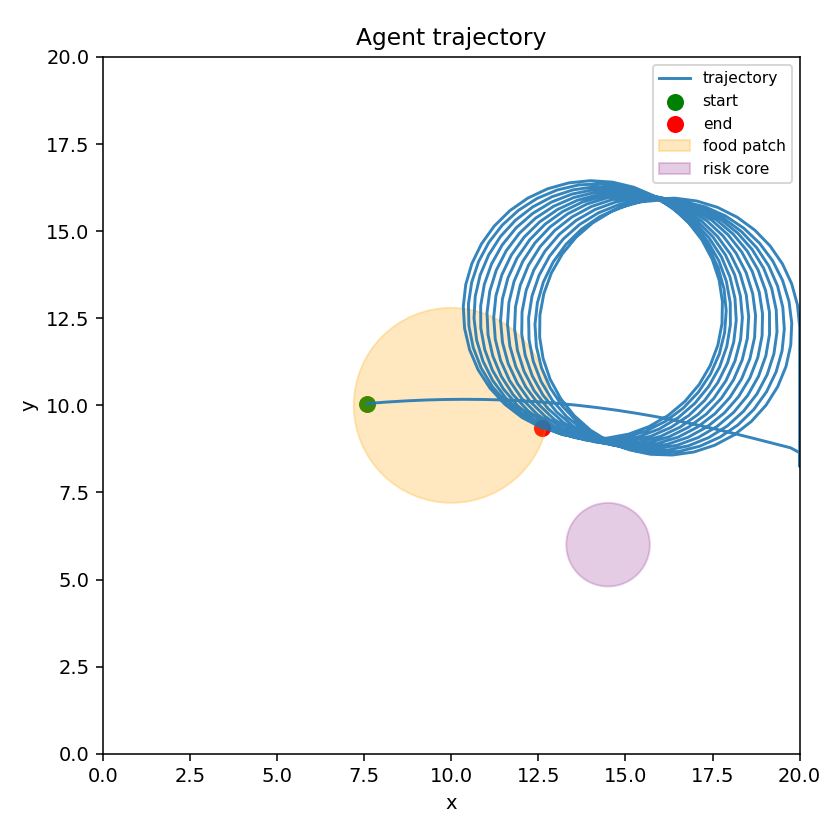 | 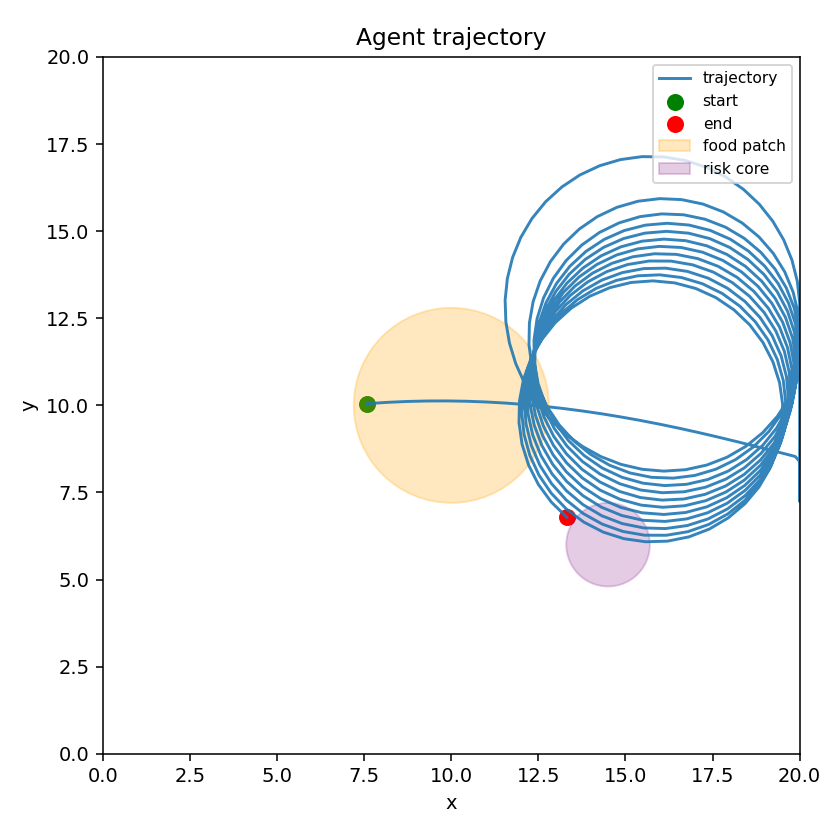 |

GA-uni はパッチ近傍で密に周回。Per-env はより広い軌道でパッチを安定的に再訪。
Per-env の方が in_patch のスパイクがより等間隔で規則的 — alpha_h=0.031 が
h のゆるやかな振動を通じて安定した周期的行動を生んでいる。

**F（small world）: uni=20, per-env=23 — 狭い空間での適応が類似**

| GA-universal 内部状態 | GA per-env 内部状態 |
|---|---|
| 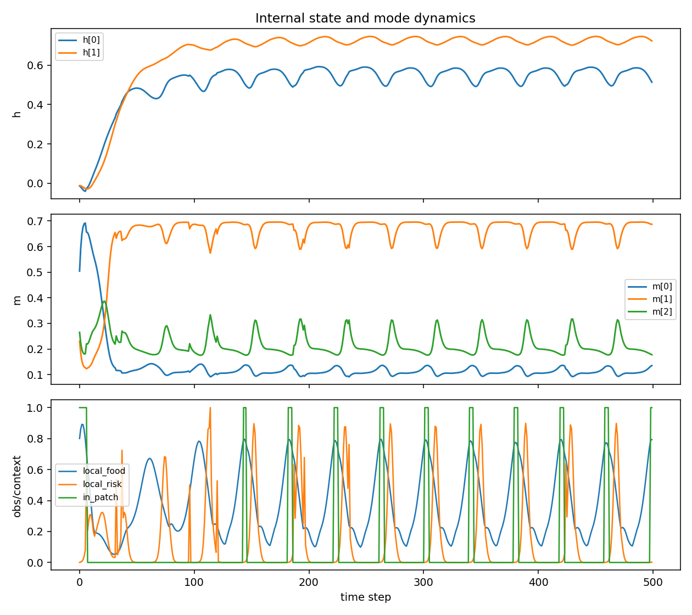 | 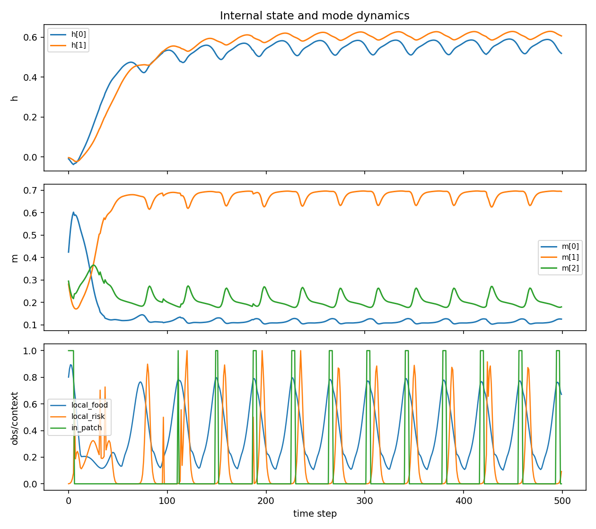 |

両者の内部状態パターンは非常に類似。h の振動周期・振幅、m の explore 優勢パターンが
ほぼ同一。小世界では限られた軌道しか取れないため、パラメータの違いが
行動パターンに反映されにくい。

**G（3 patches）: uni=41, per-env=47 — 訪問パッチ数に差**

| GA-universal 軌跡 | GA per-env 軌跡 |
|---|---|
|  |  |

| GA-universal 内部状態 | GA per-env 内部状態 |
|---|---|
| 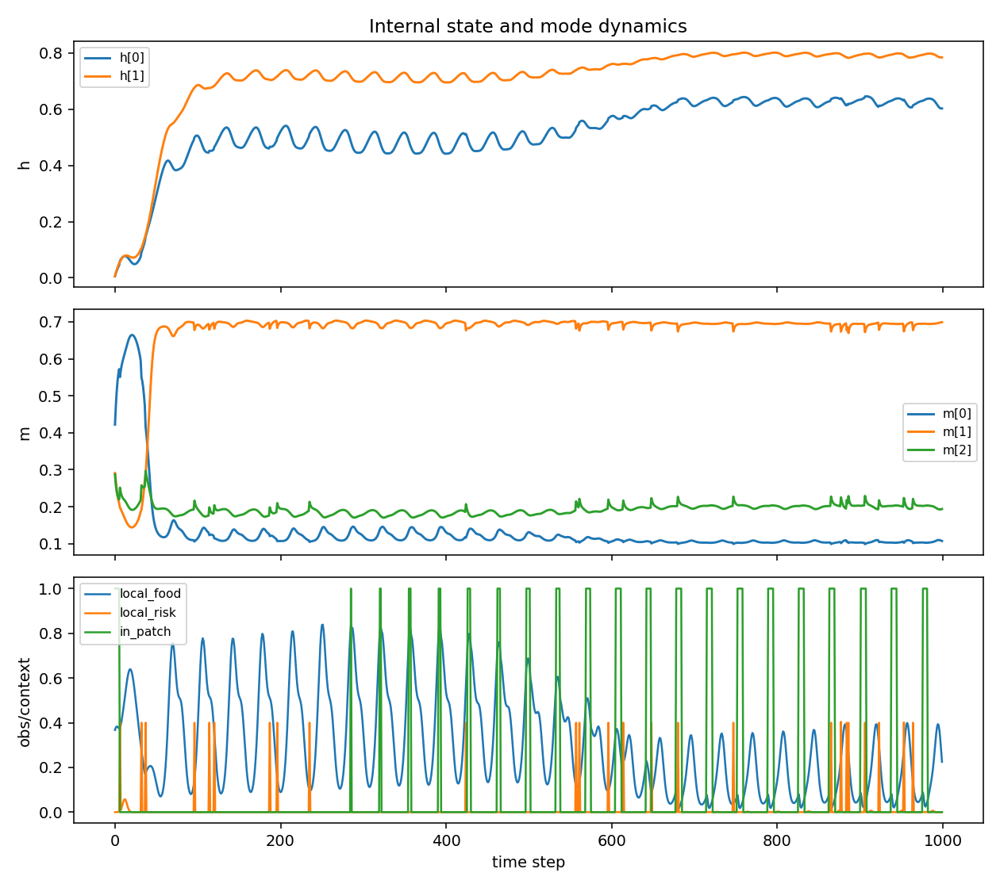 | 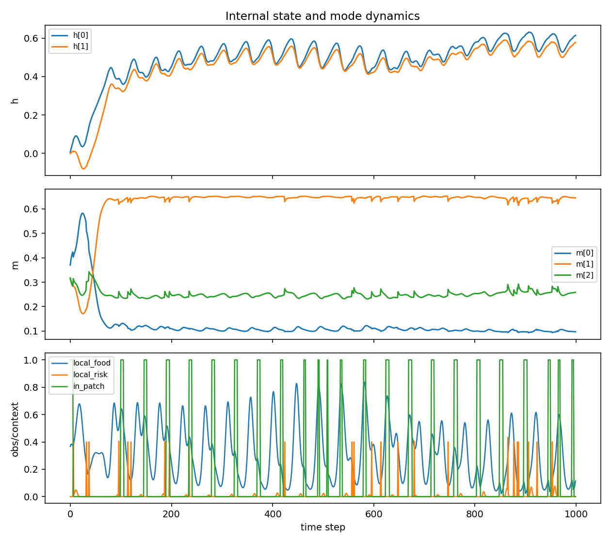 |

GA-uni はパッチ1・2の2パッチ巡回。Per-env はパッチ2・3を中心により広い巡回。
内部状態で注目すべきは per-env の h の振幅がやや小さく（alpha_h=0.058 vs 0.053）、
h がより速く更新されることでパッチ間の情報統合が促進されている。
ただし食物獲得で per-env が上回る（0.314 vs 0.300）のは軽微な差であり、
再訪数の差（47 vs 41）が主な違い。

### 分析

transitions で見ると、**GA-universal は per-env ceiling の約 89%** に達している。

環境別の汎化コスト:
- **A, B**: ほぼ天井到達（100-107%）— 汎用パラメータで十分
- **D, E, F**: 軽微な汎化コスト（88-94%）— 実用上問題なし
- **C, G**: 明確な汎化コスト（79-81%）— 特化パラメータとの差が目立つ

**C（高速枯渇）が弱い理由**: 枯渇率が速い環境に適応するには h の変化が速い方がよい
（per-env GA: alpha_h=0.036）が、他の環境では h が遅い方がよいため妥協が生じる。

**G（3パッチ）が弱い理由**: 3 パッチ巡回の最適化には per-env GA が alpha_h=0.058 と
h を速め、パッチ間の情報統合を促進しているが、GA-universal はそこまで h を速められない。

### 結論

**「すべての環境に対応する単一パラメータ」は見つかった。ただし天井の約9割。**

GA-universal は手動設計に比べ全環境で大幅に改善し（transitions +161%）、
per-env ceiling の 89% を単一パラメータで達成した。
残り 11% は「環境特化の余地」であり、アーキテクチャ制約ではない。

真にアーキテクチャ拡張が必要な課題:
- **環境 C（高速枯渇）**: per-env 特化でも food=0.040 と低い。枯渇率の時間的推定が必要 → h の次元拡張または新変数
- **環境 G（3パッチ）**: per-env では transitions=53.7 と高いが GA-uni では 43.7。
  複数資源の品質比較のためには i_t の空間的分解能向上が有効な可能性
